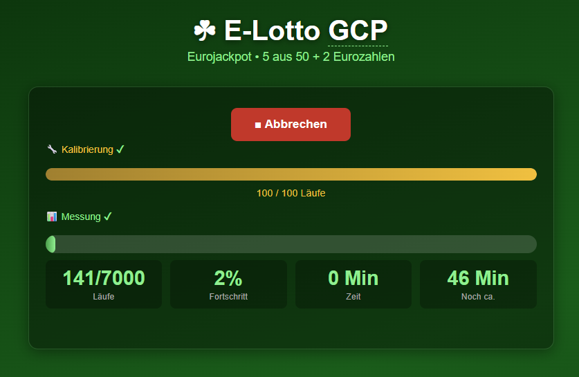
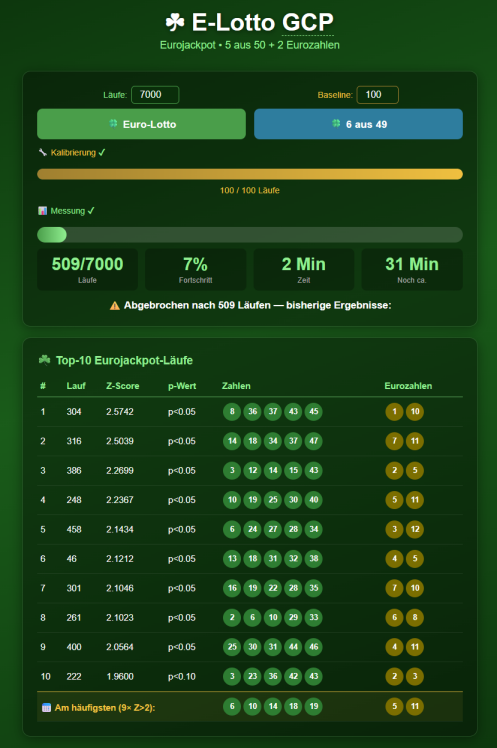

# E-Lotto — GCP Analysis on ESP32-P4

ESP32-P4 project that generates Eurojackpot and 6-of-49 lottery numbers using the hardware
TRNG and [GCP methodology (Global Consciousness Project)](https://grokipedia.com/page/Global_Consciousness_Project).

## Screenshots

<table>
<tr>
<td align="center"><b>Measurement running</b></td>
<td align="center"><b>Results with Top-10 + Most frequent</b></td>
</tr>
<tr>
<td></td>
<td></td>
</tr>
</table>

## Hardware

- **Master (COM4):** Waveshare ESP32-P4-ETH — webserver, GCP, Eurojackpot/6-of-49
- **Slave (COM6):** second Waveshare ESP32-P4-ETH — GCP + UART1 handler only
- **PHY:** IP101GRI via RMII (Ethernet RJ45, DHCP) — master only
- **CPU:** ESP32-P4 @ 360 MHz, 768 KB SRAM
- **Chip revision:** v1.3 (sdkconfig adjusted: `CONFIG_ESP32P4_REV_MIN_0=y`)
- **UART1 connection:** Master GPIO14 → Slave GPIO15 (TX→RX), Master GPIO15 ← Slave GPIO14 (RX←TX), GND↔GND, 460800 baud

## Concept

Each run reads 200,000 TRNG values directly from the hardware register and evaluates them
using GCP methodology:
- **32,000 segments** of 200 bits each
- Z-score per segment: `(ones − 100) / √50`
- Run Z-score: `Σ(Z_segment) / √32,000`, **corrected by baseline mean**
- The **Top-10 runs** with the highest corrected Z-score yield the lottery numbers
- Additionally: most frequent numbers from **all runs with Z > 2**

## Web Interface

Accessible in the browser via Ethernet after startup (read IP from Serial Monitor).

| Element | Description |
|---|---|
| **Runs** | Input field, default 1000, max 8000 |
| **Baseline** | Calibration runs, default 100, max 5000 |
| **Euro-Lotto** | 5 numbers (1–50) + 2 bonus numbers (1–12) |
| **6 of 49** | 6 numbers (1–49) |
| **Calibration phase** | Gold progress bar with ✔ when done |
| **Number scoring phase** | Blue progress bar with ✔ when done |
| **Measurement phase** | Green progress bar with runtime, ETA and ✔ when done |
| **Most frequent** | Most frequent numbers from Top-10 + all further Z>2 runs |
| **Abort** | Stops after current run, shows Top-10 of runs so far |
| **Save CSV** | Downloads current run as `.csv` file (appears after completion) |
| **Load previous CSV** | Load earlier CSVs and merge with current run (appears after scoring) |
| **Browser reload** | ESP32 keeps running in background; page reconnects automatically |
| **Diagnostics** | `http://<IP>/diag` — compares register vs esp_random() |

## Key Code

### 1 — Direct TRNG Register Access

Instead of `esp_random()` (which goes through an internal driver), the hardware register
is read directly — **75× faster**, identical quality:

```c
// sensor.c
#define RNG_REG  (*((volatile uint32_t *)0x501101A4UL))
static inline uint32_t fast_rng(void) { return RNG_REG; }
```

### 2 — GCP Z-Score with `__builtin_popcount`

Per 200-bit segment, 6×32 + 1×8 = 200 bits are read with 7 TRNG reads.
`__builtin_popcount` counts the ones in one clock cycle instead of a 32-bit loop
(**28× less CPU work** per segment):

```c
// sensor.c — gcp_zscore_raw()
for (int seg = 0; seg < 32000; seg++) {
    int ones = __builtin_popcount(fast_rng())   // 32 bits
             + __builtin_popcount(fast_rng())
             + __builtin_popcount(fast_rng())
             + __builtin_popcount(fast_rng())
             + __builtin_popcount(fast_rng())
             + __builtin_popcount(fast_rng())
             + __builtin_popcount(fast_rng() & 0xFF);  //  8 bits
    z_sum += (ones - 100.0) / 7.07106781;  // sqrt(50) ≈ 7.071
}
return z_sum / sqrt(32000.0);
```

### 3 — Dual-ESP: Combined Z-Score (SNR ×√2)

Both ESPs measure simultaneously. The combined Z-score increases SNR by factor √2:

```c
// sensor.c — elotto_task() measurement loop
if (use_slave) uart_write_bytes(SLAVE_UART, "M\n", 2);  // start slave
double z = gcp_zscore_raw() - g_status.baseline_mean;   // master measures in parallel
if (use_slave) {
    double zs = slave_measure();                          // read slave Z
    if (s_slave_ok) z = (z + zs) * 0.70710678;           // ÷√2, SNR ×√2
}
```

Baseline calibration also runs in parallel: `slave_baseline_start()` sends `B<n>\n`
before the master loop, `slave_baseline_wait()` reads `OK\n` afterward — both run concurrently.

UART protocol (ASCII, 460800 baud):
```
P\n       → OK\n          Ping (startup)
B<n>\n    → OK\n          Baseline (n runs, blocks slave)
M\n       → Z:<float>\n   Measure (master + slave in parallel)
A\n       → OK\n          Abort
```

### 4 — Two-Phase Measurement (Baseline Correction)

The TRNG has a systematic bias of approx. −0.022 per segment.
Over 32,000 segments this accumulates to **Z ≈ −3.95 per run** without correction.
Solution: Phase 1 measures the bias, Phase 2 subtracts it:

```c
// sensor.c — elotto_task()

// Phase 1: Calibration
g_status.phase = PHASE_BASELINE;
double bsum = 0.0;
for (int i = 0; i < baseline_total; i++) {
    bsum += gcp_zscore_raw();
    g_status.baseline_done = i + 1;
}
double baseline_mean = bsum / baseline_total;

// Phase 2: Bias-corrected measurement
g_status.phase = PHASE_MEASURING;
for (int i = 0; i < runs_total; i++) {
    double z = gcp_zscore_raw() - baseline_mean;   // ← correction
    g_status.results[i].z_score = z;
}
```

### 5 — Frequency Analysis (Most Frequent)

After all runs complete, number frequencies are aggregated across **all Z>2 runs**.
For Top-10, the already-drawn numbers are counted directly; for additional Z>2 runs
beyond rank 10, new draws are performed:

```c
// sensor.c — after qsort + extract_numbers()
for (int i = 0; i < done; i++) {
    if (g_status.results[i].z_score <= 2.0) break;  // sorted descending
    z2_count++;
    if (i < TOP_N) {
        // directly count already-drawn Top-10 numbers
        for (int j = 0; j < nm; j++) freq[results[i].nums[j]]++;
    } else {
        // new draw for additional Z>2 runs
        draw_unique_sorted(tmp, nm, max_val, mask);
        for (int j = 0; j < nm; j++) freq[tmp[j]]++;
    }
}
// Extract top-N most frequent numbers + sort ascending
```

### 6 — Unbiased Rejection Sampling for Lottery Numbers

Modulo operations introduce bias when `max_val` is not a divisor of 2^n.
Rejection sampling discards unsuitable values entirely:

```c
// sensor.c
static uint8_t draw_unbiased(uint8_t max_val, uint8_t mask) {
    uint8_t v;
    do { v = (uint8_t)((fast_rng() & mask) + 1); } while (v > max_val);
    return v;
    // Eurojackpot: mask=63 → 1..64, reject >50; ~21% discarded
    // 6 of 49:     mask=63 → 1..64, reject >49; ~23% discarded
    // Bonus nums:  mask=15 → 1..16, reject >12; ~25% discarded
}
```

## Insights from Development

### TRNG Register is 75× Faster than esp_random()

The diagnostics (`/diag`) showed:

```json
{"reg_ms":3, "reg_bias":0.499220, "reg_stuck":0, "reg_z_mean":-0.0221,
 "esp_ms":225, "esp_bias":0.499310, "esp_stuck":0, "esp_z_mean":-0.0195,
 "speedup":75.0}
```

- No stuck values (reg_stuck: 0) — no correlations
- Bit bias: 0.499220 instead of ideal 0.500000 — tiny but measurable deviation
- **Critical:** without baseline correction the bias produces systematically Z ≈ −3.95 per run

### Baseline Correction is Mandatory

The systematic hardware bias accumulates over 32,000 segments:

```
E[z_run] = -0.0221 × √32,000 ≈ -3.95 per run
```

Solution analogous to the eTensor project (Princeton PEAR lab methodology):
1. **Phase 1:** N calibration runs → determine `baseline_mean`
2. **Phase 2:** Measurement runs, each corrected: `z_corrected = z_raw - baseline_mean`

This gives each measurement an expected value of 0 — statistically correct.

### TRNG Register Address was Initially Biased

Direct access to register `0x501101A4` produced **exclusively positive Z-scores** in an
early test (all 50 runs > 0). Likely cause: TRNG initialization state on very first start.
After full IDF boot and with baseline correction the register works correctly.

Temporarily `esp_random()` was used — correct results, but 75× slower.

### Timing Benchmarks (200,000 values/run, ESP32-P4 @ 360 MHz, direct register)

| Config | Calibration | Measurement | Total |
|---|---|---|---|
| 100 baseline + 1000 runs | ~20 s | ~3 min | **~3 min** |
| 100 baseline + 4000 runs | ~20 s | ~13 min | **~14 min** |
| 100 baseline + 7000 runs | ~20 s | ~26 min | **~27 min** |
| 1000 baseline + 7000 runs | ~3 min | ~26 min | **~29 min** |

For comparison with `esp_random()` (75× slower): 1000 runs ≈ 4 hours.

### Optimizations

- **`__builtin_popcount`** instead of 200-bit loop: 28× less CPU work per segment
- **Direct TRNG register** instead of `esp_random()`: 75× faster (TRNG-limited)
- **Baseline correction**: eliminates hardware bias, statistically correct Z-scores
- **Rejection sampling**: bias-free lottery number drawing without modulo bias

### RAM Limit

`RunResult` occupies ~40 bytes. **Maximum: ~8000 runs** (320 KB result array).
Enforced in UI. ESP32-P4 has 768 KB SRAM.

### Chip Revision v1.3

Bootloader error on first flash: `requires chip revision [v3.1 - v3.99]`.  
Fix: `idf.py menuconfig` → Component config → ESP32P4-Specific →
Minimum Supported ESP32-P4 Revision → v0.0

## Build & Flash

```powershell
# IDF terminal (desktop shortcut "IDF_v6.0.1_Powershell")
cd D:\E-Lotto\elotto
idf.py build
idf.py flash -p COM4
idf.py monitor -p COM4
```

## Diagnostics

```
http://<IP>/diag
```

Compares direct TRNG register with `esp_random()`: speed, bias,
correlations, Z-score distribution. Runtime approx. 5 seconds.

## Environment

- ESP-IDF v6.0.1 (`C:\esp\v6.0.1\esp-idf`)
- Tools: `C:\Espressif` (EIM standard on this system)
- Target: `esp32p4`, chip rev v1.3

## Project Structure

```
main/
  elotto.c    — app_main, Ethernet, webserver, HTML/JS incl. /diag, CSV Save/Load
  sensor.c    — GCP analysis, TRNG register, baseline, slave UART, lottery extraction
  sensor.h    — types, ElottoStatus (incl. phase/baseline fields)
docs/
  screenshot_laufend.png   — web UI during measurement
  screenshot_ergebnis.png  — web UI with Top-10 + most-frequent result
build.ps1     — build helper script for standard PowerShell
sdkconfig     — ESP-IDF configuration

elotto_slave/main/
  slave.c     — slave GCP handler, UART1 protocol (P/B/M/A commands), timestamps in log
```

## Version History

| Version | Description |
|---|---|
| v1.0 | GCP webserver, Eurojackpot + 6-of-49, live progress, abort, Top-10 |
| v1.1 | Browser reconnect: page restores state after reload |
| v1.2 | 200K TRNG values/run, popcount optimization, configurable runs (max 8000) |
| v1.3 | Direct TRNG register (75× faster) + baseline calibration, /diag endpoint |
| v1.4 | Button grid layout, most-frequent row (Z>2), abort text, checkmarks |
| v1.5 | Dual-ESP: slave via UART1 (460800 baud), combined Z-score (÷√2, SNR ×√2), parallel baseline |
| v1.6 | CSV save/load in browser, parallel slave baseline, JS fix (buttons) |
