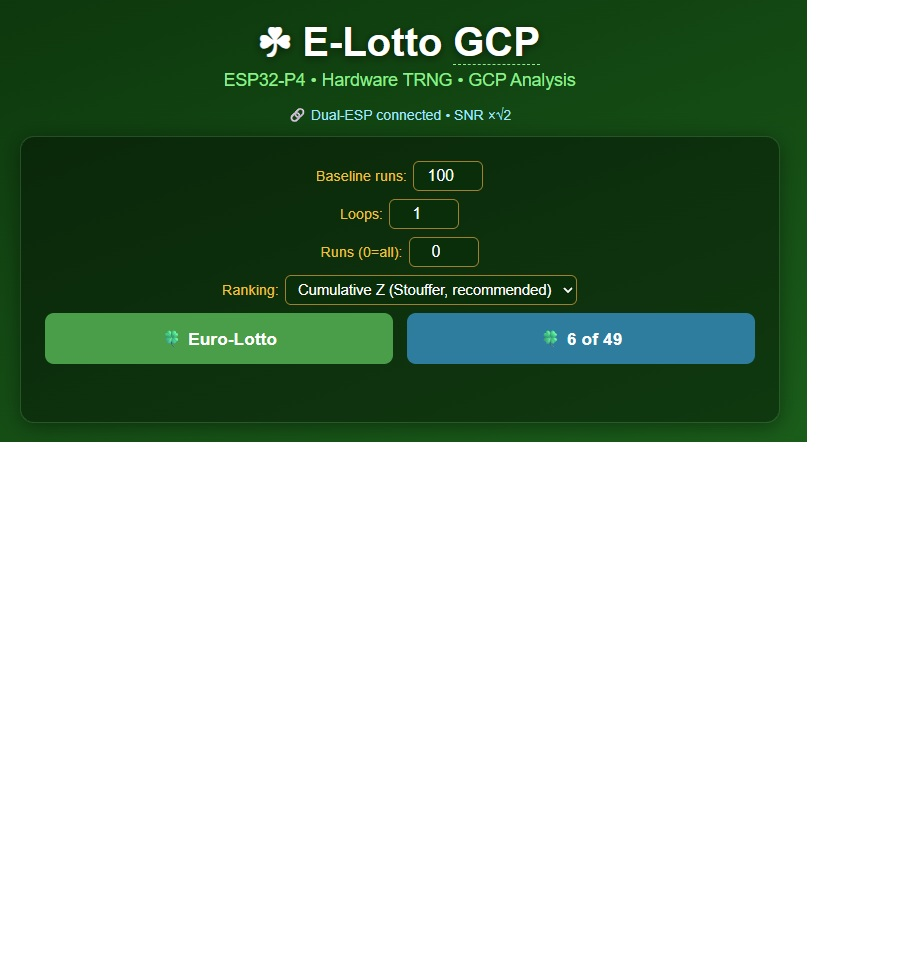
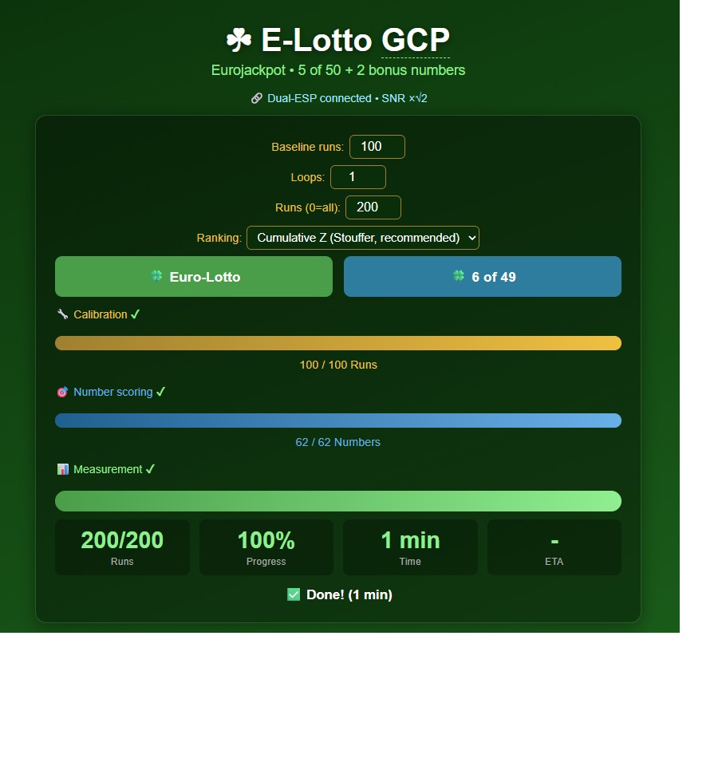
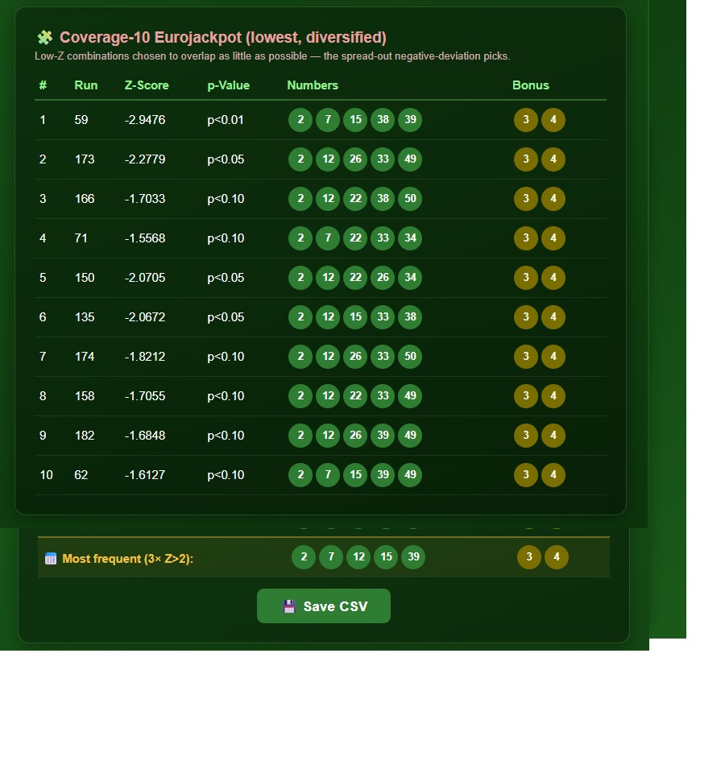

# E-Lotto — GCP Analysis on ESP32-P4

ESP32-P4 project that generates Eurojackpot and 6-of-49 lottery numbers using the hardware
TRNG and [GCP methodology (Global Consciousness Project)](https://grokipedia.com/page/Global_Consciousness_Project).

## In a Nutshell

A hobby experiment that turns two ESP32 chips into a tiny "random-event detector" inspired by
the [Global Consciousness Project](https://grokipedia.com/page/Global_Consciousness_Project).
The whole idea in plain language:

- Each chip has a **true hardware random number generator** (randomness from electrical
  noise). Over a fair sample it produces 0-bits and 1-bits in equal amounts.
- The device grabs millions of these bits and asks: *did this batch lean a little more toward
  1s (or 0s) than pure chance predicts?* That tiny lean is summarized as a **Z-score** — how
  many standard deviations the batch sits from "perfectly fair." Z ≈ 0 is ordinary; large
  positive or large negative means an unusually one-sided batch.
- It attaches a Z-score to **lottery number combinations**: for each candidate combination it
  takes a fresh batch of randomness and records how far it deviated. Combinations tied to the
  biggest deviations rise to the top (and the biggest *negative* deviations to the bottom).
- Measuring **many times** and adding the deviations together — instead of keeping a single
  lucky spike — lets a real, repeatable lean stand out from noise. A built-in **significance
  check** then says honestly whether anything actually beat chance.

You watch it live in a web browser: a progress bar per phase, a loop counter, the current
**Top-10** (most positive Z) and **Bottom-10** (most negative Z), and the most-frequent
numbers.

Two chips instead of one? A second ESP measures the same instant on its own independent
randomness; combining two independent measurements sharpens the signal (see
[Dual-ESP](#dual-esp-master--slave)).

> **Reality check:** a real lottery draw is physically independent of these measurements, so
> this **cannot predict winning numbers**. The interest is in measuring tiny statistical
> deviations in true randomness *correctly*. Treat the output as an experiment, not a betting
> tip.

## What is "Coverage Mode"? (in plain words)

When you rank lottery combinations purely by Z-score, the very top picks tend to look almost
identical — they share most of their numbers (you'll see 1-2-5-9-… repeated across nearly
every row). Ten near-duplicate tickets only "cover" a handful of numbers, so they essentially
all win or all lose together.

**Coverage mode fixes that.** Instead of just taking the ten highest-scoring combinations, it
picks ten that are each strong *and* as different from one another as possible:

1. Take the ~50 best-scoring combinations.
2. Keep the best one.
3. Add the next-best one **only if it doesn't reuse too many numbers** already used — at most
   half overlap with any ticket already chosen (≤3 shared for 6-of-49, ≤2 for Eurojackpot).
4. Repeat until ten are chosen (if the rule is too strict to reach ten, the rest are filled by
   score).

The result is ten strong tickets spread across many more numbers, so together they touch a
much larger slice of the possible draws. (This is the classic lottery idea of **wheeling** —
playing a spread of tickets — except here the numbers to spread are chosen by the GCP scores
instead of by hand.)

You get two such sets:
- **🧩 Coverage (highest Z)** — the spread-out picks with the biggest *positive* deviation.
- **🧩 Coverage (lowest Z)** — the spread-out picks with the biggest *negative* deviation.

> It still can't beat the lottery — the draw is independent of the measurement. Coverage just
> makes the suggestions less repetitive and spread over more of the number space.

**Requires Cumulative Z ranking.** Coverage is built from the full, repeatedly-measured
ranking, so in Peak-Z mode the coverage tables are empty.

## Screenshots

<table>
<tr>
<td align="center"><b>Start screen</b></td>
<td align="center"><b>Run finished</b></td>
</tr>
<tr>
<td></td>
<td></td>
</tr>
<tr>
<td>Inputs: <b>Baseline runs</b>, <b>Loops</b>, <b>Runs</b> (0 = all) and the
<b>Ranking</b> mode, then the Euro-Lotto / 6-of-49 buttons.</td>
<td>The three phases — calibration, number scoring, measurement — each fill to 100&nbsp;% with
a ✔, plus runs / progress / time / ETA.</td>
</tr>
</table>

<table>
<tr>
<td align="center"><b>Coverage (highest Z)</b></td>
<td align="center"><b>Coverage (lowest Z)</b></td>
</tr>
<tr>
<td></td>
<td></td>
</tr>
<tr>
<td>Ten diversified high-Z combinations (spread out to cover more draws), the
<b>significance line</b> (most extreme |Z| + corrected p) and the most-frequent row. Save CSV
exports both coverage sets.</td>
<td>Ten diversified low-Z combinations — the spread-out largest-negative-deviation picks.</td>
</tr>
</table>

## Hardware

- **Master (COM4):** Waveshare ESP32-P4-ETH — webserver, GCP, Eurojackpot/6-of-49
- **Slave (COM6):** second Waveshare ESP32-P4-ETH — GCP + UART1 handler only
- **PHY:** IP101GRI via RMII (Ethernet RJ45, DHCP) — master only
- **CPU:** ESP32-P4 @ 360 MHz, 768 KB SRAM
- **Chip revision:** v1.3 (sdkconfig adjusted: `CONFIG_ESP32P4_REV_MIN_0=y`)
- **UART1 connection:** Master GPIO14 → Slave GPIO15 (TX→RX), Master GPIO15 ← Slave GPIO14 (RX←TX), GND↔GND, 460800 baud

## Concept

**Goal: filter out the best number *combinations* by scoring them with the GCP algorithm.**
The combinations whose parallel TRNG stream deviates most strongly from chance — the highest
baseline-corrected **Z-scores** — are surfaced as the suggested lottery numbers.

Each **GCP run** reads 200,000 TRNG values directly from the hardware register:
- **32,000 segments** of 200 bits each
- Z-score per segment: `(ones − 100) / √50`
- Run Z-score: `Σ(Z_segment) / √32,000`, **corrected by the baseline mean**

### Program flow

A job runs three phases, optionally repeated over several **loops**:

1. **Baseline calibration** (`PHASE_BASELINE`) — N runs measure the TRNG's systematic bias;
   master and slave calibrate in parallel.
2. **Number scoring** (`PHASE_SCORING`) — every individual candidate number gets one GCP run.
   The highest-scoring numbers form a small candidate **pool**.
3. **Combination measurement** (`PHASE_MEASURING`) — every combination of the pool is
   enumerated lexicographically and measured with its own GCP run, then ranked by Z-score
   (a large |Z| in either direction is the interesting signal). The displayed result is the
   diversified **Coverage** set — see [Coverage Mode](#what-is-coverage-mode-in-plain-words).

| Mode | Candidate pool | Combinations / loop |
|---|---|---|
| 6 of 49 | best **15** of 49 | C(15,6) = **5005** |
| Eurojackpot | best **12** of 50 + best **5** of 12 | C(12,5) × C(5,2) = 792 × 10 = **7920** |

### Ranking across loops

**Loops** repeat the experiment N times so that a real, repeatable lean stands out from
one-off noise. Two ranking modes decide how the loops are combined:

- **Cumulative Z (Stouffer, default)** — the candidate pool is locked after loop 0 and the
  *same* combination set is re-measured every loop, accumulating `Σz` per combination. The
  ranking is by **`Z = Σz / √k`** over `k` loops, which improves the signal-to-noise ratio by
  √k and converges to the true deviation (or 0). This is the GCP cumulative-deviation method
  and the statistically sound choice.
- **Peak Z (best single run)** — each loop runs a fresh baseline + scoring + measurement, and
  the global **best single-run Z** is kept across all loops. Simpler, but it selects noise
  extremes (the max of thousands of runs is large even with no signal), so use it mainly for
  comparison.

After every loop the diversified **Coverage** sets (highest-Z and lowest-Z) and the
**most-frequent** numbers (aggregated across all loops' Z > 2 runs) are published live. The
raw top/bottom rankings are still computed internally to feed the significance line, but only
the Coverage view is displayed. (Coverage is built from the full cumulative ranking, so it is
shown only in **Cumulative Z** mode.)

### Honest significance

Picking the most extreme of thousands of combinations inflates apparent significance (the max
of 5005 random Z-scores is ≈ 3.5 by chance alone). So the results show the **most extreme
|Z|** together with a **Bonferroni-corrected p-value** over the number of comparisons, labelled
*significant* (p < 0.05) or *consistent with chance* — telling you whether anything genuinely
exceeded noise.

### Measurement hygiene

Four guards keep systematic hardware effects from masquerading as GCP signal:

- **Studentization** — every loop's z-values are re-expressed as `(z − loop mean) / loop σ`
  using the loop's own ~5005 measurements. This removes the unstable TRNG bias with a far
  better estimate than the small baseline phase (whose error would otherwise accumulate
  √k-coherently across loops), and makes per-run Z exactly N(0,1) even if raw register reads
  are correlated (true σ ≠ 1). The pre-scaling **per-run σ** is shown in the results — ~1.000
  means the TRNG is healthy.
- **Random measurement order** — each loop measures the combinations in a fresh random
  permutation. With a fixed order, slow drift (e.g. a temperature ramp over a ~20-min loop)
  would hit each combination at the same position every loop and accumulate exactly like a
  real signal.
- **Master–slave independence check** — Pearson **r** between the per-run (z_master, z_slave)
  pairs (centered per loop), shown with per-device σ. r ≈ 0 confirms the two TRNGs are
  independent and the √2 combine is valid; the UI flags significant correlation with ⚠.
- **Stride sampling** — a `Runs` cap measures every ⌊full/cap⌋-th combination across the whole
  space instead of the lexicographic prefix (which all shared the pool's lowest numbers).

The number-scoring phase also runs **20 dual-ESP GCP runs per candidate number** (Stouffer,
slave-combined ÷√2 → per-number SE ≈ 0.16), so the pool choice — locked for the whole
cumulative session — doesn't ride on single-run noise.

## Dual-ESP: Master & Slave

The system runs on **one** ESP32-P4 (master only) or **two** (master + slave) for a higher
signal-to-noise ratio. The slave is fully **optional** — if it is not detected at startup the
master runs standalone with identical results, just without the √2 SNR boost.

### What the slave does

The slave ([hpheuer/elotto_slave](https://github.com/hpheuer/elotto_slave),
`main/slave.c`) is a second ESP32-P4 running the **identical GCP
engine** (same `gcp_zscore_raw()`, same TRNG register `0x501101A4`, same 32,000 × 200-bit
math) but **nothing else** — no Ethernet, no webserver, no lottery logic. It boots, configures
UART1, and sits in a blocking command loop waiting for the master. Its only job: when told to,
run a GCP measurement on its **own independent TRNG** and report the Z-score back.

Because the two TRNGs are physically separate noise sources, their measurements are
statistically independent. Averaging two independent Z-scores of equal variance halves the
variance, i.e. improves SNR by √2:

```
z_combined = (z_master + z_slave) / √2        // = (z_m + z_s) × 0.70710678
```

Each device subtracts **its own** baseline mean first, so the two hardware biases are removed
independently before the two Z-scores are combined.

### Wiring (UART1 crossover)

| Master | | Slave |
|---|:---:|---|
| GPIO14 (TX) | → | GPIO15 (RX) |
| GPIO15 (RX) | ← | GPIO14 (TX) |
| GND | ↔ | GND |

460800 baud, 8N1, no flow control. `SLAVE_BAUD` in `sensor.c` must equal `UART_BAUD` in `slave.c`.

### Sync protocol (ASCII, line-based)

The master is always the initiator; the slave only ever answers. Every command and reply ends
with `\n`.

| Command (master → slave) | Reply (slave → master) | Meaning |
|---|---|---|
| `P\n` | `OK\n` | Ping — detect the slave at startup |
| `B<n>\n` | `OK\n` (after n runs) | Run n baseline runs, store own baseline mean |
| `M\n` | `Z:<float>\n` | Run one measurement, return baseline-corrected Z |
| `A\n` | `OK\n` | Abort the current/next operation |

The slave discards boot noise and UART break bytes (`0x00` and bytes ≥ `0x80`), so a master
reset cannot desync its line parser.

### How they run in parallel

The trick is that the master **triggers the slave first, then does its own work while the
slave works** — so the two measurements overlap in wall-clock time instead of running
back-to-back. Net cost of the slave per measurement is only the UART round-trip, not a second
full GCP run.

**Startup**
```
master  slave_init() ──── "P\n" ───►  slave
master  slave_connected = true ◄─ "OK\n" ── slave
```

**Phase 1 — baseline (parallel)**
```
master  slave_baseline_start(n) ── "B<n>\n" ─►  slave    (fire-and-forget)
master  ── runs its own n baseline runs ──┐  both calibrate
slave   ── runs its own n baseline runs ──┘  simultaneously
master  slave_baseline_wait() ◄──── "OK\n" ──── slave    (resync at the end)
```

**Phase 2 — every combination (parallel)**
```
for each combination:
  master  "M\n" ──────────────►  slave starts measuring
  master  gcp_zscore_raw() ─────  both measure the same time window
  master  slave_measure() ◄─ "Z:<float>\n" ── slave
  master  z = (z_master + z_slave) / √2
```

**Abort**
```
master  "A\n" ─►  slave sets g_abort and returns from its run at the next
        4000-segment checkpoint (a non-blocking UART poll inside gcp_zscore_raw)
```

### Robustness

- **Optional / auto-detected** — `slave_init()` pings once; on timeout the master clears
  `slave_connected` and runs solo. A `static bool installed` guard makes re-pings safe.
- **Self-healing disconnect** — if the slave ever misses its reply window
  (`slave_baseline_wait` / `slave_measure`), the master sets `s_slave_ok = false` and finishes
  the job master-only instead of hanging.
- **Proportional baseline timeout** — `slave_baseline_wait()` waits `baseline_total × 800 ms +
  15 s`, so a large baseline (minutes of slave work) never trips a false timeout.
- **Cooperative abort** — the slave polls for an `A` byte every 4000 segments, so even a long
  in-flight run stops within ~½ second.
- **Per-loop** — in multi-loop runs every loop re-issues `B<n>\n` and the per-combination
  `M\n`/`Z:` exchange, so master and slave stay in lock-step across all loops.

## Web Interface

Accessible in the browser via Ethernet after startup (read IP from Serial Monitor).

| Element | Description |
|---|---|
| **Baseline runs** | Calibration runs per loop, default 100 (10–5000) |
| **Loops** | How often the whole experiment repeats, default 1 (1–50) |
| **Runs (0=all)** | Cap on measured combinations per loop for quick tests, `0` = all |
| **Ranking** | Cumulative Z (Stouffer, default) or Peak Z (best single run) |
| **Euro-Lotto** | 5 numbers (1–50) + 2 bonus numbers (1–12) |
| **6 of 49** | 6 numbers (1–49) |
| **🔁 Loop X / N** | Loop counter, shown while running when Loops > 1 |
| **Calibration phase** | Gold progress bar with ✔ when done |
| **Number scoring phase** | Blue progress bar with ✔ when done |
| **Measurement phase** | Green progress bar with runtime, ETA and ✔ when done |
| **🧩 Coverage (highest Z)** | Diversified high-Z picks (spread out); updates live after each loop |
| **🧩 Coverage (lowest Z)** | Diversified low-Z picks (largest negative deviation) |
| **Significance line** | Most extreme \|Z\| + Bonferroni-corrected p over N comparisons |
| **Stats line** | per-run σ (TRNG health, ideal 1.0) · master–slave r with ok/⚠ flag · σm/σs |
| **Most frequent** | Most frequent numbers across all Z>2 runs |
| **Abort** | Stops after current run, shows cumulative results so far |
| **Save CSV** | Downloads both Coverage sections (highest + lowest Z) as `.csv` |
| **Browser reload / close** | ESP keeps running all loops; page reconnects and shows live progress |
| **Diagnostics** | `http://<IP>/diag` — compares register vs esp_random() |

## Key Code

### 1 — Direct TRNG Register Access

Instead of `esp_random()` (which goes through an internal driver), the hardware register
is read directly — **75× faster**, identical quality:

```c
// sensor.c
#define RNG_REG  (*((volatile uint32_t *)0x501101A4UL))
static inline uint32_t fast_rng(void) { return RNG_REG; }
```

### 2 — GCP Z-Score with `__builtin_popcount`

Per 200-bit segment, 6×32 + 1×8 = 200 bits are read with 7 TRNG reads.
`__builtin_popcount` counts the ones in one clock cycle instead of a 32-bit loop
(**28× less CPU work** per segment):

```c
// sensor.c — gcp_zscore_raw()
for (int seg = 0; seg < 32000; seg++) {
    int ones = __builtin_popcount(fast_rng())   // 32 bits
             + __builtin_popcount(fast_rng())
             + __builtin_popcount(fast_rng())
             + __builtin_popcount(fast_rng())
             + __builtin_popcount(fast_rng())
             + __builtin_popcount(fast_rng())
             + __builtin_popcount(fast_rng() & 0xFF);  //  8 bits
    z_sum += (ones - 100.0) / 7.07106781;  // sqrt(50) ≈ 7.071
}
return z_sum / sqrt(32000.0);
```

### 3 — Dual-ESP: Combined Z-Score (SNR ×√2)

Both ESPs measure simultaneously. The combined Z-score increases SNR by factor √2:

```c
// sensor.c — elotto_task() measurement loop
if (use_slave) uart_write_bytes(SLAVE_UART, "M\n", 2);  // start slave
double z = gcp_zscore_raw() - g_status.baseline_mean;   // master measures in parallel
if (use_slave) {
    double zs = slave_measure();                          // read slave Z
    if (s_slave_ok) z = (z + zs) * 0.70710678;           // ÷√2, SNR ×√2
}
```

Baseline calibration also runs in parallel. See **[Dual-ESP: Master & Slave](#dual-esp-master--slave)**
for the full protocol, timing and robustness details.

### 4 — Bias Correction: Studentization per Loop

The TRNG has a large, *unstable* systematic bias (measured between **Z ≈ −4 and +5 per run**
across sessions). The baseline phase gives a rough estimate for display, but the real
correction is **studentization**: each loop's z-values are centered on the loop's own mean and
scaled by the loop's own empirical σ — the ~5005 measurement runs are a far better bias
estimator than a small baseline, taken in the very same time window, and the σ scaling keeps
Z ~ N(0,1) even if raw register reads are partially correlated:

```c
// sensor.c — studentize(), after each loop
double m = Σ z_i / n,  s = √(Σ(z_i − m)² / (n−1));   // loop's own mean and σ
g_status.loop_sigma = s;                              // TRNG health metric (ideal 1.0)
for (i)  z_i = (z_i − m) / s;                         // exactly N(0,1) under the null
```

Measurement order is a fresh **Fisher–Yates permutation** every loop (`s_perm[]`), so slow
drift cannot hit the same combinations at the same loop position each time and accumulate
√k-coherently like a real signal.

### 5 — Number Scoring → Candidate Pool

Numbers are **not** drawn randomly. Every candidate number is GCP-scored with **20
slave-combined runs** (Stouffer per number, ÷√2 like Phase 2); the highest-scoring numbers
form the pool that combinations are later built from:

```c
// sensor.c — score_and_build_pool()
for (int k = 1; k <= max_val; k++)
    for (int r = 0; r < SCORE_REPS; r++)   // 20 dual-ESP runs per number (Stouffer)
        scores[k] += score_one_run();      // master + slave in parallel, / sqrt(2)
// keep the pool_size highest scores, then insertion-sort the pool ascending
```

### 6 — Combination Enumeration & Ranking

Phase 2 enumerates **every** combination of the pool lexicographically (no randomness),
GCP-scores each, and ranks them by Z-score:

```c
// sensor.c — elotto_task() Phase 2
for (int i = 0; i < runs_total; i++) {
    int mi = i % main_combos, ei = i / main_combos;   // lexicographic index
    nth_combination(pool_main, pool_nm, nm, mi, g_status.results[i].nums);
    if (euro) nth_combination(pool_euro, 5, 2, ei, g_status.results[i].euro);
    g_status.results[i].z_score = gcp_zscore_raw() - g_status.baseline_mean;
}
qsort(g_status.results, runs_total, sizeof(RunResult), cmp_desc);   // rank by Z desc
```

### 7 — Ranking Across Loops (Peak vs Cumulative)

**Peak Z** keeps the best single-run Z across all loops (`absorb_loop()`): each loop's
Top-N/Bottom-N is merged into a running carry. Simple, but it selects noise extremes.

**Cumulative Z** (default) is the GCP cumulative-deviation method: the pool is locked, the
*same* combinations are re-measured each loop, and the per-combination sum `Σz` is ranked by
the **Stouffer Z = Σz/√k**. Under the null this stays ~N(0,1), so the p-value is meaningful,
and the signal-to-noise ratio grows √k:

```c
// sensor.c — per loop: accumulate Σz over the fixed combination set
for (int i = 0; i < runs_total; i++) s_zsum[i] += g_status.results[i].z_score;
meas_k++;

// sensor.c — publish_cumulative(): rank by Stouffer Z, no in-place sort so the
// combination↔index mapping stays stable for the next loop's accumulation
for (int i = 0; i < n; i++) g_status.results[i].z_score = s_zsum[i] / sqrt((double)k);
// insertion-select Top-N (highest) and Bottom-N (lowest) into g_status.top[]/low[]
```

### 8 — Bottom-10 + Bonferroni-Corrected Significance

A strongly **negative** Z is as significant as a positive one (large |Z|), so the lowest-Z
combinations are tracked and shown too. The most extreme |Z| is reported with a
multiple-comparison-corrected p-value, so a big-looking Z from a huge search is judged
honestly:

```c
// sensor.c — compute_significance()
double zmax = max(|top[0].z|, |low[0].z|);
double p1   = erfc(zmax / sqrt(2));          // two-sided single-test tail
double pc   = min(1.0, comparisons * p1);    // Bonferroni over N comparisons
// comparisons = runs_total (cumulative)  |  runs_total × loops (peak)
```

### 9 — Coverage: Diversified Picks (the displayed result)

The raw top-N picks overlap heavily and cover few distinct draws. `publish_coverage()` instead
greedily selects, from the COVER_POOL most extreme combinations, up to TOP_N that each share at
most `nm/2` numbers with every already-chosen one — strong by Z but spread out. Run for both the
highest-Z and lowest-Z pools. See [Coverage Mode](#what-is-coverage-mode-in-plain-words) for the
plain-language version.

```c
// sensor.c — publish_coverage(): greedy max-spread over the top-Z candidates
for (j in candidates by Z) {              // best score first
    shared = max overlap with any already-chosen pick;
    if (shared <= nm/2) keep(j);          // strong AND different enough
    if (chosen == TOP_N) break;
}
// pass 2: if the rule was too strict, fill the rest by Z
```

## Insights from Development

### TRNG Register is 75× Faster than esp_random()

The diagnostics (`/diag`) showed:

```json
{"reg_ms":3, "reg_bias":0.499220, "reg_stuck":0, "reg_z_mean":-0.0221,
 "esp_ms":225, "esp_bias":0.499310, "esp_stuck":0, "esp_z_mean":-0.0195,
 "speedup":75.0}
```

- No stuck values (reg_stuck: 0) — no correlations
- Bit bias: 0.499220 instead of ideal 0.500000 — tiny but measurable deviation
- **Critical:** without baseline correction the bias produces systematically Z ≈ −3.95 per run

### Baseline Correction is Mandatory

The systematic hardware bias accumulates over 32,000 segments:

```
E[z_run] = -0.0221 × √32,000 ≈ -3.95 per run
```

Solution analogous to the eTensor project (Princeton PEAR lab methodology):
1. **Phase 1:** N calibration runs → determine `baseline_mean`
2. **Phase 2:** Measurement runs, each corrected: `z_corrected = z_raw - baseline_mean`

This gives each measurement an expected value of 0 — statistically correct.

### TRNG Register Address was Initially Biased

Direct access to register `0x501101A4` produced **exclusively positive Z-scores** in an
early test (all 50 runs > 0). Likely cause: TRNG initialization state on very first start.
After full IDF boot and with baseline correction the register works correctly.

Temporarily `esp_random()` was used — correct results, but 75× slower.

### Timing Benchmarks (200,000 values/run, ESP32-P4 @ 360 MHz, direct register)

| Config | Calibration | Measurement | Total |
|---|---|---|---|
| 100 baseline + 1000 runs | ~20 s | ~3 min | **~3 min** |
| 100 baseline + 4000 runs | ~20 s | ~13 min | **~14 min** |
| 100 baseline + 7000 runs | ~20 s | ~26 min | **~27 min** |
| 1000 baseline + 7000 runs | ~3 min | ~26 min | **~29 min** |

For comparison with `esp_random()` (75× slower): 1000 runs ≈ 4 hours.

### Optimizations

- **`__builtin_popcount`** instead of 200-bit loop: 28× less CPU work per segment
- **Direct TRNG register** instead of `esp_random()`: 75× faster (TRNG-limited)
- **Baseline correction**: eliminates hardware bias, statistically correct Z-scores
- **Number scoring + combination enumeration**: candidates are GCP-ranked, not randomly drawn
- **Cumulative (Stouffer) Z**: Σz/√k across loops — SNR grows √k, converges instead of
  chasing noise extremes; honest Bonferroni-corrected significance

### RAM Limit

`RunResult` occupies ~40 bytes. **Maximum: ~8000 runs** (320 KB result array).
Enforced in UI. ESP32-P4 has 768 KB SRAM.

### Chip Revision v1.3

Bootloader error on first flash: `requires chip revision [v3.1 - v3.99]`.  
Fix: `idf.py menuconfig` → Component config → ESP32P4-Specific →
Minimum Supported ESP32-P4 Revision → v0.0

## Build & Flash

```powershell
# IDF terminal (desktop shortcut "IDF_v6.0.1_Powershell")
cd D:\E-Lotto\elotto
idf.py build
idf.py flash -p COM4
idf.py monitor -p COM4
```

## Diagnostics

```
http://<IP>/diag
```

Compares direct TRNG register with `esp_random()`: speed, bias,
correlations, Z-score distribution. Runtime approx. 5 seconds.

## Environment

- ESP-IDF v6.0.1 (`C:\esp\v6.0.1\esp-idf`)
- Tools: `C:\Espressif` (EIM standard on this system)
- Target: `esp32p4`, chip rev v1.3

## Project Structure

```
main/
  elotto.c    — app_main, Ethernet, webserver, HTML/JS incl. /diag, CSV save, loop UI
  sensor.c    — GCP analysis, TRNG register, baseline, number scoring, combination
                enumeration, multi-loop accumulation, coverage selection, slave UART
  sensor.h    — types, ElottoStatus (phase/baseline/loop/ranking/coverage fields)
docs/
  ui_start.png       — start screen (inputs + mode buttons)
  ui_done.png        — a finished run (three phase bars complete)
  coverage_high.png  — Coverage highest-Z table + significance + most-frequent
  coverage_low.png   — Coverage lowest-Z table
build.ps1     — build helper script for standard PowerShell
sdkconfig     — ESP-IDF configuration

elotto_slave/  — separate repo: https://github.com/hpheuer/elotto_slave
  main/slave.c — slave GCP handler, UART1 protocol (P/B/M/A commands), timestamps in log
```

## Version History

| Version | Description |
|---|---|
| v1.0 | GCP webserver, Eurojackpot + 6-of-49, live progress, abort, Top-10 |
| v1.1 | Browser reconnect: page restores state after reload |
| v1.2 | 200K TRNG values/run, popcount optimization, configurable runs (max 8000) |
| v1.3 | Direct TRNG register (75× faster) + baseline calibration, /diag endpoint |
| v1.4 | Button grid layout, most-frequent row (Z>2), abort text, checkmarks |
| v1.5 | Dual-ESP: slave via UART1 (460800 baud), combined Z-score (÷√2, SNR ×√2), parallel baseline |
| v1.6 | CSV save/load in browser, parallel slave baseline, JS fix (buttons) |
| v1.7 | Multi-loop runs: cumulative global Top-10, live intermediate results after each loop, loop counter, `Runs` cap for quick tests; device-side loop (browser-independent); docs updated to reflect number-scoring + combination-enumeration flow |
| v1.8 | Cumulative (Stouffer) Z ranking mode `Σz/√k` (default) vs Peak Z, selectable; Bottom-10 lowest-Z table; Bonferroni-corrected significance line; CSV save with Top-10 + Bottom-10; plain-language "In a Nutshell" overview |
| v1.9 | Diversified **Coverage** selection (greedy max-spread over the top-/bottom-Z pool) for highest- and lowest-Z; results view is now coverage-only (raw Top/Bottom tables removed, kept internally only for significance); slimmer `/status`; removed inert CSV-load path; plain-language "What is Coverage Mode?" section |
| v2.0 | GCP methodology upgrade: per-loop **studentization** (`(z−m)/σ`, TRNG health σ published), **random measurement order** per loop (drift immunity), **master–slave independence check** (Pearson r, per-loop centered, per-device σ), 5× number scoring, **stride sampling** for capped runs, fewer yields (~15% faster). ⚠ Z-scores not comparable with pre-v2.0 sessions |
