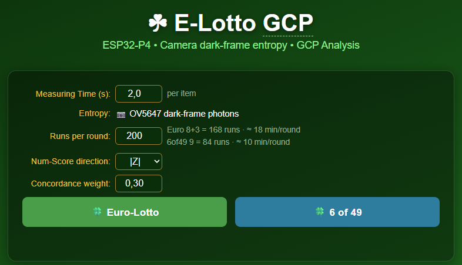
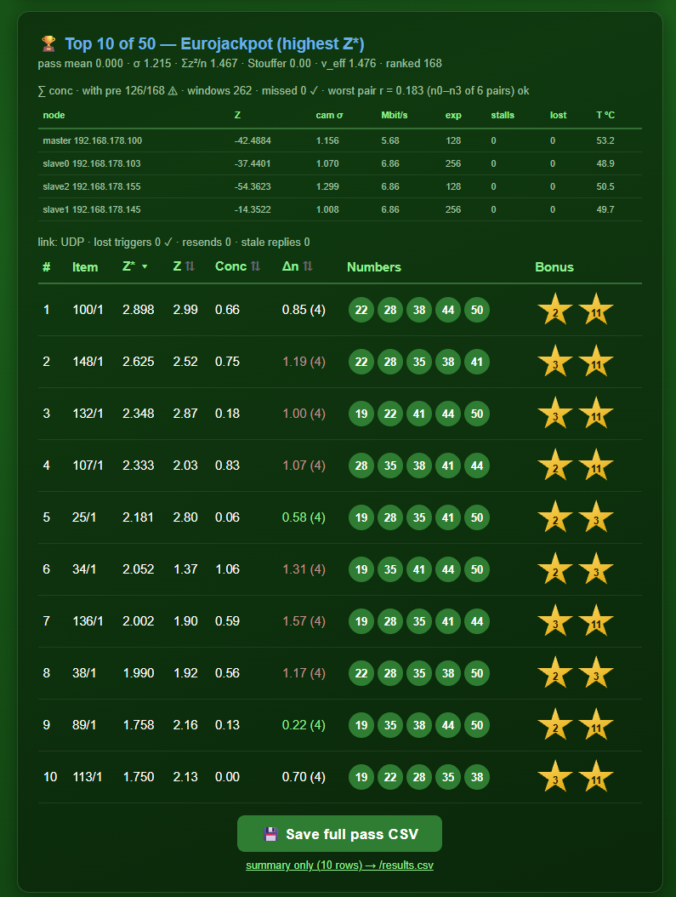
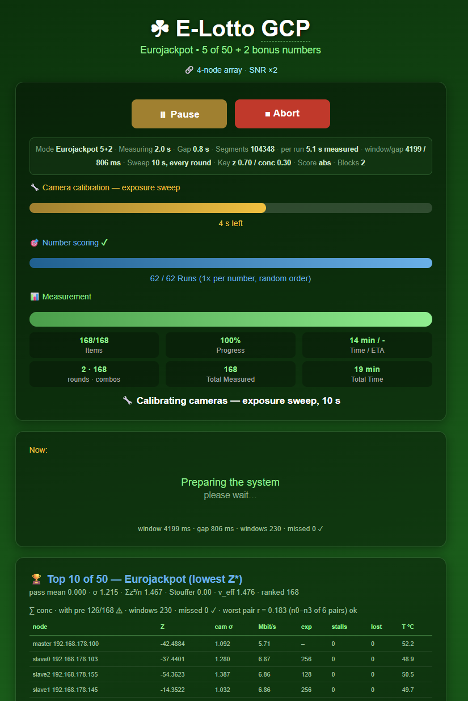
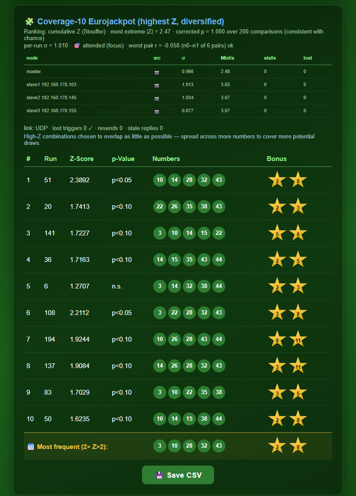
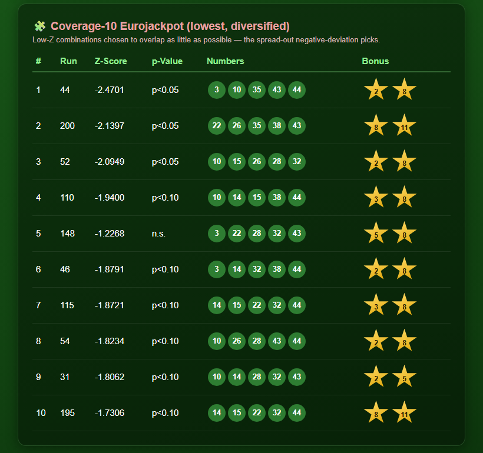

# E-Lotto — GCP Analysis on ESP32-P4

ESP32-P4 project that scores Eurojackpot and 6-of-49 number combinations from **camera sensor
noise** using
[GCP methodology (Global Consciousness Project)](https://grokipedia.com/page/Global_Consciousness_Project).

## Abstract

A four-node ESP32-P4 array that measures whether a physical random process deviates from chance
while a human observer attends to a specific target. It is a home-built version of the instrument
used by the [Global Consciousness Project](https://grokipedia.com/page/Global_Consciousness_Project)
and, before it, Princeton's PEAR lab. The lottery framing supplies the *target* — something
concrete for an observer to hold in mind — and is **not** a prediction claim.

The design follows eight principles, and most of the engineering exists to serve them:

1. **Randomness has to come from physics, not from a chip's opinion of physics.** Every node draws
   bits from its **own** image sensor — never a shared one, which would make the nodes correlated
   by construction. The on-chip hardware RNG was **deleted** from the firmware, not merely
   deselected: a whitened digital RNG is indistinguishable from a real effect in every statistic
   computed here, so keeping it as an option meant the instrument could always produce a result
   nobody could attribute.

2. **Subtract two frames, not one frame from zero.** Each bit comes from the difference between
   two consecutive frames, `f[2k+1] − f[2k]`, taking the lowest bit of each pixel's difference.
   Differencing cancels every *fixed* sensor artefact exactly — per-pixel offsets, dark current
   gradients, column patterns — because they are identical in both frames. What survives is only
   what changed between them: photon shot noise and sensor read noise.

3. **Count the ones.** One *run* reads ~2.4 million bits (11,950 segments of 200) and asks how far
   the number of 1-bits sits from the expected half. That distance, expressed in standard
   deviations, is the **Z-score**. Z ≈ 0 is an ordinary batch; large |Z| means a lopsided one.
   Dividing by √segments keeps Z ~ N(0,1) whatever the run length.

4. **A biased sensor is tolerable; a drifting one is not.** Real sensors do not sit at exactly
   0.5. A *constant* bias is removed exactly by principle 5. A bias that **drifts** survives
   centering and accumulates like a real signal, so the instrument measures its own drift
   continuously — per-loop camera recalibration, a cross-loop drift regression, and a per-loop
   record of everything that was subtracted.

5. **Re-centre every loop on itself (studentization).** After each loop, every Z becomes
   `(Z − loop mean) / loop σ`, estimated from that loop's own hundreds of measurements. This
   removes the sensor's offset far better than a short calibration phase could, and forces the
   per-run distribution to N(0,1). The published `loop_sigma` is the health check: **≈1.000 means
   the array is behaving as a null instrument should.**

6. **Independent measurements add; correlated ones only look like they do.** Four nodes measuring
   the same instant combine as `Σz / √k`, which sharpens signal-to-noise by √k — *if* they are
   independent. That is an assumption, so it is tested rather than trusted: all six pairwise
   correlations and every per-node σ are published live, and inter-node correlation shows up in
   `loop_sigma` even when the pairwise check misses it.

7. **The observer has to be present while the bits are collected.** A Focus panel shows the
   current target in large type for exactly the window its bits are sampled in — that is the
   original GCP/PEAR protocol, not decoration. Attended and unattended sessions are therefore
   *different experiments*, tagged as such and never pooled; unattended runs are the matched
   control.

8. **Searching thousands of candidates inflates significance, so say so.** The largest of 5,005
   random Z-scores is ≈3.5 by chance alone. Results are reported with a **Bonferroni-corrected**
   p-value over the number of comparisons actually made, and labelled *significant* or *consistent
   with chance* accordingly.

> **What this cannot do.** A lottery draw is physically independent of these measurements, so this
> **cannot predict winning numbers** and no amount of Z-score will change that. What it can do is
> measure tiny deviations in physical randomness *correctly and honestly*, and record whether an
> attending observer makes any difference. Treat the output as an experiment, not a betting tip.
>
> **Status:** the ×√n gain from four nodes is **not yet established** — see
> [`docs/PLAN_HISTORY.md`](docs/PLAN_HISTORY.md) §1.12 and [`CLAUDE.md`](CLAUDE.md) for the open questions and what
> each measurement actually showed.

## In a Nutshell

A hobby experiment that turns a small array of ESP32 chips into a tiny "random-event detector"
inspired by
the [Global Consciousness Project](https://grokipedia.com/page/Global_Consciousness_Project).
The whole idea in plain language:

- Each chip produces a stream of **physically random bits** from its own **camera sensor**, and
  from nothing else — the built-in hardware RNG has been removed from the firmware entirely (see
  [Camera Entropy](#camera-entropy-ov5647-dark-frame)). The bits come from the difference between
  consecutive frames, so they are photon shot noise plus sensor read noise, taken raw. Over a fair
  sample this produces 0-bits and 1-bits in equal amounts.
- The device grabs millions of these bits and asks: *did this batch lean a little more toward
  1s (or 0s) than pure chance predicts?* That tiny lean is summarized as a **Z-score** — how
  many standard deviations the batch sits from "perfectly fair." Z ≈ 0 is ordinary; large
  positive or large negative means an unusually one-sided batch.
- It attaches a Z-score to **lottery number combinations**: for each candidate combination it
  takes a fresh batch of randomness and records how far it deviated. Combinations tied to the
  biggest deviations rise to the top (and the biggest *negative* deviations to the bottom).
- Measuring **many times** and adding the deviations together — instead of keeping a single
  lucky spike — lets a real, repeatable lean stand out from noise. A built-in **significance
  check** then says honestly whether anything actually beat chance.

You watch it live in a web browser: a progress bar per phase, a loop counter, the current
**Top-10** (most positive Z) and **Bottom-10** (most negative Z), and the most-frequent
numbers.

Four chips instead of one? Three more ESPs measure the same instant, each on its own
independent randomness — **its own camera**, never a shared one — and combining independent
measurements sharpens the signal by √n (see [The node array](#the-node-array-master--slaves)).

> **Reality check:** a real lottery draw is physically independent of these measurements, so
> this **cannot predict winning numbers**. The interest is in measuring tiny statistical
> deviations in true randomness *correctly*. Treat the output as an experiment, not a betting
> tip.

## What is "Coverage Mode"? (in plain words)

When you rank lottery combinations purely by Z-score, the very top picks tend to look almost
identical — they share most of their numbers (you'll see 1-2-5-9-… repeated across nearly
every row). Ten near-duplicate tickets only "cover" a handful of numbers, so they essentially
all win or all lose together.

**Coverage mode fixes that.** Instead of just taking the ten highest-scoring combinations, it
picks ten that are each strong *and* as different from one another as possible:

1. Take the ~50 best-scoring combinations.
2. Keep the best one.
3. Add the next-best one **only if it doesn't reuse too many numbers** already used — at most
   half overlap with any ticket already chosen (≤3 shared for 6-of-49, ≤2 for Eurojackpot).
4. Repeat until ten are chosen (if the rule is too strict to reach ten, the rest are filled by
   score).

The result is ten strong tickets spread across many more numbers, so together they touch a
much larger slice of the possible draws. (This is the classic lottery idea of **wheeling** —
playing a spread of tickets — except here the numbers to spread are chosen by the GCP scores
instead of by hand.)

You get two such sets:
- **🧩 Coverage (highest Z)** — the spread-out picks with the biggest *positive* deviation.
- **🧩 Coverage (lowest Z)** — the spread-out picks with the biggest *negative* deviation.

> It still can't beat the lottery — the draw is independent of the measurement. Coverage just
> makes the suggestions less repetitive and spread over more of the number space.

**Requires Cumulative Z ranking.** Coverage is built from the full, repeatedly-measured
ranking, so in Peak-Z mode the coverage tables are empty.

## Screenshots

<table>
<tr>
<td align="center"><b>Start screen</b></td>
<td align="center"><b>Run finished</b></td>
</tr>
<tr>
<td></td>
<td></td>
</tr>
<tr>
<td>Inputs: <b>Baseline runs</b>, <b>Loops</b>, <b>Runs</b> (0 = all), the
<b>Ranking</b> mode, the <b>Entropy</b> source and the <b>Focus display</b> checkbox, then the
Euro-Lotto / 6-of-49 buttons.</td>
<td>The stats line records the session's condition (<i>attended (focus)</i> vs
<i>unattended (control)</i>), per-run σ, the worst of the six pairwise correlations, the
per-node health table and UDP link health.</td>
</tr>
</table>

### Focus display

<table>
<tr><td align="center"><b>What is being measured, while it is being measured</b></td></tr>
<tr><td></td></tr>
<tr>
<td>The current target is held for exactly the window its bits are collected in — a single
candidate number during scoring, the whole draw during measurement — so the observer is present
while the noise is sampled (the original GCP/PEAR protocol). Eurojackpot's 1–12 bonus numbers
are <b>stars</b> rather than circles: the two pools overlap in value, so shape is what separates
them at a glance. The line underneath is the instrument's own check —
<code>window · gap · windows · missed</code> — where <b>missed</b> counts windows the UI never
saw, the failure that would credit an effect to the wrong combination. <b>Pause</b> holds
between runs without losing the loop; paused time is excluded from the elapsed clock.
See <a href="docs/PLAN.md">PLAN.md</a>.</td>
</tr>
</table>

<table>
<tr>
<td align="center"><b>Coverage (highest Z)</b></td>
<td align="center"><b>Coverage (lowest Z)</b></td>
</tr>
<tr>
<td></td>
<td></td>
</tr>
<tr>
<td>Ten diversified high-Z combinations (spread out to cover more draws), the
<b>significance line</b> (most extreme |Z| + corrected p) and the most-frequent row. Save CSV
exports both coverage sets.</td>
<td>Ten diversified low-Z combinations — the spread-out largest-negative-deviation picks.</td>
</tr>
</table>

## Hardware

Four Waveshare ESP32-P4-ETH boards on one switch. All four run the same measurement engine; the
master additionally serves the web UI and drives the session.

| node | address | power | role |
|---|---|---|---|
| master | 192.168.178.100 | PoE | web UI, GCP, session control |
| slave0 | 192.168.178.103 | PoE | GCP + UDP command loop |
| slave1 | 192.168.178.145 | PoE | GCP + UDP command loop |
| slave2 | 192.168.178.155 | PoE | GCP + UDP command loop |

- **Cameras:** one OV5647 per node on its own MIPI-CSI connector (SCCB on GPIO8/7, XCLK
  unwired — the RPi-style module clocks itself), in a shared enclosure where they **see some
  ambient, constant light** (`mean_pixel` ≈ 15–40). **Never shared between nodes** — a shared
  source would break independence by construction.
- **Lighting:** constant light, not darkness — a sealed dark box measurably hurt the statistics
  (per-run σ 1.08 vs 1.00 lit; see [`docs/PLAN_HISTORY.md`](docs/PLAN_HISTORY.md) §1.11–1.13). Two hard rules: the
  LED needs its **own supply** — never a node's VSYS pin — and it must be **constant current, not
  PWM**. Both were learned the hard way.
- **Power:** all four boards take PoE directly, no splitters. ⚠ The master previously ran on
  separate USB power as the control for whether a shared rail correlates the nodes
  (`PLAN_NETWORK` Risk 1). That split has been **retired by decision**, so inter-node correlation
  can no longer be attributed to the rail. The one measurement taken while it was intact found no
  rail effect (master↔slave pairs mean r +0.023 vs slave↔slave +0.024).
- **PSRAM:** mandatory when the camera source is used (capture buffers + extraction ring)
- **PHY:** IP101GRI via RMII (Ethernet RJ45, DHCP) — on **every** node
- **CPU:** ESP32-P4 @ 360 MHz, 768 KB SRAM
- **Chip revision:** v1.3 (sdkconfig adjusted: `CONFIG_ESP32P4_REV_MIN_0=y`)
- **Node link:** UDP on the shared switch — broadcast trigger to port 5000, unicast replies.
  The UART1 crossover this used before is gone; see [docs/PLAN.md](docs/PLAN.md)
- **USB:** recovery only — bootloader, partition table, or a board whose factory updater is
  gone. Firmware ships over Ethernet. Every node carries its own updater in `factory`.
  Addresses above are informational: the master finds nodes by broadcast, so nothing depends
  on them

## Concept

**Goal: filter out the best number *combinations* by scoring them with the GCP algorithm.**
The combinations whose parallel noise stream deviates most strongly from chance — the highest
baseline-corrected **Z-scores** — are surfaced as the suggested lottery numbers.

Each **GCP run** consumes a fixed batch of raw noise bits, in 200-bit segments:
- **Segments per run: 11,950 (≈ 2.4 Mbit, ≈ 1000 ms)** — one source, so one constant, used for
  scoring, measurement and baseline alike. It travels on the wire (`M<seg>`, `B<runs>,<seg>`), so
  a node that is *told* the length cannot disagree about it.
  Run length only sets granularity — statistical power per second is rate-limited either way,
  and Z stays N(0,1) because it is normalised by √segments.
- Z-score per segment: `(ones − 100) / √50`
- Run Z-score: `Σ(Z_segment) / √segments`, **corrected by the baseline mean**

### Program flow

A job runs three phases, optionally repeated over several **loops**:

1. **Baseline calibration** (`PHASE_BASELINE`) — N runs measure the noise source's systematic
   bias; master and slave calibrate in parallel.
2. **Number scoring** (`PHASE_SCORING`) — every individual candidate number gets one GCP run.
   The highest-scoring numbers form a small candidate **pool**.
3. **Combination measurement** (`PHASE_MEASURING`) — every combination of the pool is
   enumerated lexicographically and measured with its own GCP run, then ranked by Z-score
   (a large |Z| in either direction is the interesting signal). The displayed result is the
   diversified **Coverage** set — see [Coverage Mode](#what-is-coverage-mode-in-plain-words).

| Mode | Candidate pool | Combinations / loop |
|---|---|---|
| 6 of 49 | best **15** of 49 | C(15,6) = **5005** |
| Eurojackpot | best **12** of 50 + best **5** of 12 | C(12,5) × C(5,2) = 792 × 10 = **7920** |

### Ranking across loops

**Loops** repeat the experiment N times so that a real, repeatable lean stands out from
one-off noise. Two ranking modes decide how the loops are combined:

- **Cumulative Z (Stouffer, default)** — the candidate pool is locked after loop 0 and the
  *same* combination set is re-measured every loop, accumulating `Σz` per combination. The
  ranking is by **`Z = Σz / √k`** over `k` loops, which improves the signal-to-noise ratio by
  √k and converges to the true deviation (or 0). This is the GCP cumulative-deviation method
  and the statistically sound choice.
- **Peak Z (best single run)** — each loop runs a fresh baseline + scoring + measurement, and
  the global **best single-run Z** is kept across all loops. Simpler, but it selects noise
  extremes (the max of thousands of runs is large even with no signal), so use it mainly for
  comparison.

After every loop the diversified **Coverage** sets (highest-Z and lowest-Z) and the
**most-frequent** numbers (aggregated across all loops' Z > 2 runs) are published live. The
raw top/bottom rankings are still computed internally to feed the significance line, but only
the Coverage view is displayed. (Coverage is built from the full cumulative ranking, so it is
shown only in **Cumulative Z** mode.)

### Honest significance

Picking the most extreme of thousands of combinations inflates apparent significance (the max
of 5005 random Z-scores is ≈ 3.5 by chance alone). So the results show the **most extreme
|Z|** together with a **Bonferroni-corrected p-value** over the number of comparisons, labelled
*significant* (p < 0.05) or *consistent with chance* — telling you whether anything genuinely
exceeded noise.

### Measurement hygiene

Five guards keep systematic hardware effects from masquerading as GCP signal:

- **Studentization** — every loop's z-values are re-expressed as `(z − loop mean) / loop σ`
  using the loop's own ~5005 measurements. This removes the unstable source bias with a far
  better estimate than the small baseline phase (whose error would otherwise accumulate
  √k-coherently across loops), and makes per-run Z exactly N(0,1) even if raw reads are
  correlated (true σ ≠ 1). The pre-scaling **per-run σ** is shown in the results — ~1.000
  means the noise source is healthy.
- **Random measurement order** — each loop measures the combinations in a fresh random
  permutation. With a fixed order, slow drift (e.g. a temperature ramp over a ~20-min loop)
  would hit each combination at the same position every loop and accumulate exactly like a
  real signal.
- **Node independence check** — Pearson **r** for **every** node pair (6 pairs at four nodes),
  centered per loop and accumulated only over runs where both nodes contributed; the full matrix
  and per-node σ are published in `/status`, and the UI flags |r|·√n > 3 with ⚠. r ≈ 0 across all
  pairs is what makes the ÷√k combine valid — one correlated pair is enough to break it, which is
  why the UI shows the **worst** pair rather than an average.
  (This is why each node needs its **own** camera — sharing one would make r ≈ 1 by
  construction and the ×√n gain fictional.)
  ⚠ Judge a session on the per-loop combined σ **as well**: a pooled pairwise maximum once stayed
  under the flag threshold while σ climbed to 1.15.
- **Stride sampling** — a `Runs` cap measures every ⌊full/cap⌋-th combination across the whole
  space instead of the lexicographic prefix (which all shared the pool's lowest numbers).
- **Cross-loop drift check** — studentization removes each loop's *own* offset exactly, so a
  constant bias is harmless; a **trend across loops** is not, because it survives centering.
  Every completed loop therefore records its raw (pre-studentize) per-run offset and σ per
  node, and the offsets are regressed on the loop index. The results line shows
  `offset a → b · drift ±s z/loop (t = …)` and flags ⚠ at |t| > 3. The full per-loop table is
  at [`/loops`](#diagnostics) — this is the guard that only a many-hour session can exercise.

The number-scoring phase gives each candidate number **exactly one node-combined run**, sweeping
the numbers in a fresh random order (Fisher–Yates, no repeats). Per-number SE is 1/√k ≈ **0.50** at
four nodes. Repeats *in place* were deliberately removed: five consecutive runs of the same number
froze the Focus panel for ~7 s, and onset is precisely what the observer is meant to notice. The
scoring precision affects only *which* numbers enter the pool, never the measurement statistics
that follow. **If a pool choice has to be trusted on its own, run several full random passes —
never repeats in place.**

## Camera Entropy (OV5647 dark frame)

> ⚠ **Partly historical.** The technique below is current — frame pairs, diff, LSB, XOR-fold, ring
> buffer. Two things are not: the camera is now the **only** source (no `?src=`, no TRNG), and the
> **cameras see some ambient, constant light** rather than darkness. Measured figures in this
> section predate the lighting; current ones are in [`docs/PLAN_HISTORY.md`](docs/PLAN_HISTORY.md)
> §1.13, and the *current* per-node optics are on the master's live `/diag` page.

The noise source is an OV5647 camera per node. Design contract:
[docs/PLAN.md](docs/PLAN.md); the phase-by-phase gate results are in git history
(`git show 8e134e5:docs/PLAN_4NODE.md`).

### Why a camera in the dark

The ESP32-P4 TRNG is fast and passes every bias test, but it is **whitened and opaque**: what
comes out of the register has already been conditioned, so "is this deviation physical?" is not
a question the register can answer. A capped camera answers it directly. With no light reaching
the sensor, the pixel values are not zero — they are **photon shot noise** (Poisson arrival
statistics of the few photons that do arrive, quantum-origin) plus **read noise**. Nothing
whitens it; the bits are taken raw and the physics is visible in the diagnostics (`mean_pixel`,
`zero_diff`, autocorrelation).

### Extraction pipeline

Camera task → ring buffer → `noise_word()`:

1. **Non-overlapping frame pairs**, diff = `f[2k+1] − f[2k]` per pixel. Subtracting two frames
   cancels fixed-pattern noise *exactly* — every per-pixel offset, dark current gradient and
   column artefact is identical in both frames and drops out. What is left is the part that
   changed between the frames: the noise.
2. **LSB of each diff**, packed 32 bits → one `uint32` word.
3. **XOR-fold** (bit ⊕ next bit, halving the rate) — see the residual-bias note below.
4. Words go into a ring buffer (≥ 64 KB, PSRAM). `camera_read_word()` pops one; if the ring is
   empty it **waits** (`vTaskDelay`). Bits are never reused or fabricated to cover an underrun.

Sustained ≈ **3.4 Mbit/s per node** (RAW8, 800×800 @ 50 fps, exposure 16, gain 1023, AE/AGC/AWB
off, register writes verified by read-back). Throughput is limited by **PSRAM bandwidth**, not
the sensor: holding both frames of a pair dequeued instead of copying one aside took the rate
from 1.8 to 5.7 Mbit/s.

> **Task priority is load-bearing.** The extraction task (`ELOTTO_CAM_TASK_PRIO` = 4) is
> CPU-hungry, so any task calling `camera_read_word()` must run *above* it, or the producer
> starves the consumer and a run takes 5.1 s instead of 0.47 s. The master's `elotto_task` is
> priority 5; the slave's loop is `app_main` (IDF-hardcoded priority 1) and raises itself.
> Diagnostic signature of the bug: ring `drops` huge with `waits == 0`.

### Validation gates (Phase 0, master)

| | bias | per-run σ | Mbit/s | lag-1..4 r | stuck frames | mean pixel |
|---|---|---|---|---|---|---|
| **Gate** | \|b−0.5\| < 1e−3 | 1 ± 0.05 | ≥ 2 | \|r\| < 0.01 | 0 | at black floor |
| **Measured** | 0.499844 | 0.9975 | 3.419 | ≤ 0.0002 | 0 | 3.56 / 255 |

**Residual bias, honestly stated.** The *unfolded* LSB stream is biased 0.4849 — a ~3 % excess
of even diffs that symmetric noise cannot produce (only 12.6 % of diffs are 0, so quantization
starvation is ruled out); most likely ISP digital processing. The XOR-fold masks it but does not
remove the cause, and even folded the bias sits ~3σ from 0.5 over 105.9 Mbit. That propagates to
a per-run z offset of ≈ −0.33, which studentization removes exactly — *as long as it does not
drift*, which is what the [cross-loop drift check](#measurement-hygiene) watches.

**The two cameras are not equally clean, and it is not configuration.** Measured in Phase 2 with
identical verified settings: master `mean_px` 6.8 / `zero_diff` 9.4 %, slave 2.8 / 16.2 %, and
the slave's bias deviation an order of magnitude larger. Bias tracks light: more photons → more
shot noise → wider noise distribution → more uniform LSB. Sensor warming and sub-ADU
quantization starvation were both tested and refuted; the remaining explanation is per-unit
light-tightness. **If tuning this, give the dimmer camera *more* light, not less.**

### A stall drops the node — it does not fall back

There is nothing to fall back **to**, by design. The camera is the only source in this firmware,
so a node whose camera stops delivering has stopped being an instrument, and it is reported,
dropped and rebooted rather than substituted.

The reason there is no substitute is the whole point of the project: replacing opaque whitened
bits with raw physical noise. Swapping something else back in mid-session would change the physics
being measured, and a session-level flag cannot say *which* runs were affected — a stall at run 3
of 2560 would leave 2557 runs from the wrong source inside a session still labelled "camera".
Losing the run is cheaper than silently contaminating it.

What actually happens: the affected node replies `E:<reason>` instead of `Z:<z>`, the master names
it in `g_status.fault` (shown in `/status` and in orange in the UI), drops it from the combine,
bumps its reboot counter and sends `R`; the slave answers `OK` and calls `esp_restart()`. Its
camera is brought up in `app_main`, so a restart is the one recovery software has, and the node
rejoins the **next** session by discovery — never the running one.

The remaining nodes carry on over √(k−1). The session only **aborts** (`src_stalled`) if the drop
would leave fewer than two nodes, because below that the array has stopped being the instrument it
started as.

⚠ The master does **not** reboot itself on its own camera failure — that would destroy the
`/loops` history and the results the operator needs to see. It faults, reports and aborts.

⚠ These paths exist and have been reasoned about but are **unverified by choice** — see the
open-items note in [`CLAUDE.md`](CLAUDE.md). This is a research instrument, not a product.

## The node array: master + slaves

The system runs on **one** ESP32-P4 (master alone) up to **four** (master + three slaves), for
a √n improvement in signal-to-noise. Slaves are entirely **optional and self-announcing**: the
master broadcasts a discovery datagram at every session start and combines over whoever
answers. Nothing is configured — no IP list, no node count. One node produces identical
results, just without the gain.

Current array: **all four boards take PoE directly from one switch**, no splitters. The master
previously ran on separate USB power as a control for rail-borne coupling; that split came off
when its LED was fitted and is permanent. The consequence, stated plainly: inter-node correlation
can no longer be attributed to the shared rail versus anything else, because no node sits on an
independent one. The single session recorded while the split was still intact found master↔slave
pairs at mean +0.023 against slave↔slave +0.024 — i.e. **not** rail-borne — and that measurement
cannot be repeated on this rig.

### What a slave does

The slave ([hpheuer/elotto_slave](https://github.com/hpheuer/elotto_slave),
`main/slave.c`) is another ESP32-P4 running the **identical GCP engine** — and "identical" is now
literal rather than maintained by hand: `gcp_zscore_raw()` lives in the shared `elotto_gcp`
component, so master and slave compile the *same definition* of how a z-score is computed. That
matters more than it sounds: the combine is `Σz/√k` over nodes, which is only meaningful if every
node computed z the same way, and a divergence there would be invisible — a wrong-but-plausible z
looks exactly like a result. The camera extraction code is shared the same way via
`elotto_camera` (see [Project Structure](#project-structure))
and no lottery logic. It boots, brings up Ethernet, starts a small webserver (`/diag`,
`/otainfo`, `/update`) and sits in a blocking UDP command loop waiting for the master. Its only
measurement job: when told to, run a GCP measurement on its **own independent noise source** —
its own camera, never the master's — and report the Z-score back.

The webserver is not a convenience. With bootloader rollback armed, an image that cannot be
reached over the network is reverted on the next boot *by design*, so a slave without one could
not be installed at all.

Because the sources are physically separate, their measurements should be statistically
independent. Summing k independent Z-scores of unit variance and dividing by √k leaves unit
variance, so the combined score stays N(0,1) while the signal adds coherently — SNR ×√k:

```
z_combined = Σ z_node / √k        // k = nodes that actually answered THIS run
```

`k` is per-run, not per-session: a node that misses its reply, or whose camera stalled and was
dropped, simply is not in that sum. The combined z stays unit-variance either way, which is
the only property the statistics above depend on.

Each node subtracts **its own** baseline mean first, so each hardware bias is removed
independently before the scores are combined.

⚠ **Independence is an assumption, and it is tested rather than trusted.** The √n gain is only
real if the nodes do not correlate. The history is worth knowing:

| condition | mean per-run σ | worst pair |
|---|---|---|
| early 4-node session | 1.038 → 1.083 → **1.182** (growing) | +0.064 |
| 10 loops, open bench | 1.015 ± 0.012 | \|r\|√n = 0.95 |
| 5 loops, **sealed dark** enclosure | **1.0795 ± 0.0222** | \|r\|√n = 2.92 |
| 5 loops, **lit** enclosure | **1.0040 ± 0.0144** | — |

The original growth did not reproduce; sealing the enclosure brought σ inflation back (best
explanation: thermal, four self-heating boards with no airflow); lighting it restored σ to unity.
**The ×√n gain is still not established** — the mechanisms were never isolated. `/status`
publishes every pairwise r and per-node σ so this stays visible rather than assumed, and
`loop_sigma` is the more sensitive of the two: it caught inflation the pairwise check missed.
See [`docs/PLAN_HISTORY.md`](docs/PLAN_HISTORY.md) §1.12 and [CLAUDE.md](CLAUDE.md).

### Wiring (Ethernet only)

Every node plugs into the same switch. There is no link cable between them — the trigger is a
**broadcast datagram**, which is the whole reason for the change: at n nodes, one packet starts
them all within microseconds, where n sequential UART writes would skew them. The premise is
that every node integrates the *same* window, so simultaneity is the property that matters.
Latency and jitter (sub-ms either way) are irrelevant against a ~470 ms run.

### Sync protocol (ASCII over UDP)

The master is always the initiator; the slave only ever answers. Every datagram is one frame:

```
EL1 <seq> <payload>
```

The payload is unchanged from the UART era — the transport swap was deliberately kept separate
from any change to what is measured, so the statistics could be compared like with like.

| Command (master → slaves, broadcast :5000) | Reply (unicast) | Meaning |
|---|---|---|
| `P` | `OK` | Discovery — find the nodes at startup, no static IP table |
| `B<n>` | `OK` (after n runs) | Run n baseline runs, store own baseline mean; **re-arm the camera** (a session start) |
| `M` | `Z:<float>,<C\|T>` | Run one measurement, return baseline-corrected Z + the source it used (**C**amera / **T**RNG) |
| `D` | `D:<ready>,<bias>,<σ>,<Mbit/s>,<stalls>,<stuck>,<C\|T>` | Slave camera health; the master asks once per loop for the `/loops` table |
| `A` | `OK` | Abort the current/next operation |

The source tag sits **after** the float so `atof()` still parses the number and a pre-camera
slave stays compatible. A `T` tag during a camera session aborts the master too — see
[stall policy](#a-stall-aborts-the-session--it-does-not-fall-back).

**Why every frame carries a sequence number.** UART was effectively lossless and strictly
ordered, so a reply could only belong to the command just sent. UDP guarantees neither. A late
reply, accepted blindly, would pair `z_slave` of run *k* with `z_master` of run *k+1* — a
correlation bug that looks exactly like physics, and precisely the quantity `pair_r` exists to
detect. So mismatched frames are dropped and counted (`net_stale`), never used. The master
resends a timed-out command under the **same** sequence number and the slave answers a repeat of
something it has already completed from a one-entry cache, so a lost *reply* costs a round trip
while a lost *command* is re-executed exactly once. `/status` publishes `net_retries`,
`net_lost` and `net_stale` per session; the gate for the transport swap was `net_lost == 0`.

### How they run in parallel

The trick is that the master **triggers the slave first, then does its own work while the
slave works** — so the two measurements overlap in wall-clock time instead of running
back-to-back. Net cost of the slave per measurement is only the round-trip, not a second
full GCP run.

**Startup**
```
master  slave_init() ─── "EL1 <seq> P" ──►  broadcast 255.255.255.255:5000
master  slave_connected = true ◄─ "EL1 <seq> OK" ── slave (source addr = its IP)
```

**Phase 1 — baseline (parallel)**
```
master  slave_baseline_start(n) ── "B<n>" ─►  slave    (send now, collect later)
master  ── runs its own n baseline runs ──┐  both calibrate
slave   ── runs its own n baseline runs ──┘  simultaneously
master  slave_baseline_wait() ◄──── "OK" ──── slave    (resync at the end)
```

**Phase 2 — every combination (parallel)**
```
for each combination:
  master  "M<seg>" ───────────►  every node starts measuring (one datagram)
  master  gcp_zscore_raw() ─────  all measure the same time window
  master  nodes_collect()  ◄─ "Z:<float>" ── each node   (seq must match)
  master  z = Σ(z_node) / √k          over the k nodes that answered THIS run
```
No `,<C|T>` source tag any more: with one source a completed run can only have come from the
camera, and a run that could *not* complete says so outright (`E:<reason>`) instead of reporting a
substitute.

**Abort**
```
master  "A" ─►  slave sets g_abort and returns from its run at the next
        2000-segment checkpoint. The slave PEEKs the socket there and consumes
        only an 'A' — anything else (typically the master resending the command
        being executed right now) must stay queued for the command loop.
```

### Robustness

- **Optional / auto-discovered** — `nodes_discover()` broadcasts a `P` up to four times and
  collects *every* responder, re-running at each session start so a node powered on since last
  time joins and one that vanished is not left as a phantom. No IP is configured anywhere.
- **One resend, then drop for that run** — a command with no reply is resent once under the same
  sequence number (nodes that already answered serve it from cache, so only the node that
  actually missed it pays). Still silent → that node is out of *that run* and the rest combine
  over √(k−1). After `NODE_MISS_LIMIT` consecutive misses it leaves the session entirely, so an
  unplugged node degrades the array instead of taxing every later run with the full retry budget.
- **Drop-and-continue on a dead source** — a node whose camera stalls replies `E:<reason>` and is
  dropped rather than averaged in, which keeps the session source-clean by construction. There is
  no "degraded source" to report any more: with the TRNG gone a run either completed on camera
  bits or did not complete at all. The session only aborts if the drop would leave fewer than two
  nodes — the same rule as the old n=2 abort, with the floor made explicit.
- **Proportional baseline timeout** — `slave_baseline_wait()` waits `baseline_total × 800 ms +
  15 s`, so a large baseline (minutes of slave work) never trips a false timeout.
- **Cooperative abort** — the slave polls the socket every 2000 segments, so even a long
  in-flight run stops within ~½ second.
- **Session-start drain** — both ends discard queued datagrams when a session begins (`B`), the
  way the UART path flushed its input: a leftover `A` from the session that was just aborted
  must not abort the first baseline run of the next one.
- **A lost `D` is not a disconnect** — the per-loop camera-health query is diagnostics. Dropping
  a node over it would cost the session part of its SNR, so a missing answer only leaves that
  node's `/loops` columns at zero, and a missed `D` never counts toward the drop rule.
- **Per-loop** — in multi-loop runs every loop re-issues `B<n>` and the per-combination `M`/`Z:`
  exchange, so all nodes stay in lock-step across all loops.
- **Bounded waits stay bounded** — lwIP rounds `SO_RCVTIMEO` to whole milliseconds and treats
  the resulting 0 as *wait forever*, so a receive window with under ~500 µs left would hang the
  session permanently. Every timeout goes through one clamp (`link_arm_timeout()`). This is not
  hypothetical: it hung a session, and it had been latent since the UDP transport shipped.

## Web Interface

Accessible in the browser via Ethernet after startup (read IP from Serial Monitor).

| Element | Description |
|---|---|
| **Baseline runs** | Drift-reference runs per loop, default 50 (10–5000). See the note below — this is *not* the camera calibration |
| **Loops** | How often the whole experiment repeats, default 1 (1–500) |
| **Runs (0=all)** | Cap on measured combinations per loop for quick tests, `0` = all |
| **Ranking** | Cumulative Z (Stouffer, default) or Peak Z (best single run) |
| **Entropy** | 📷 Camera (OV5647) — the only source; the TRNG was removed from the firmware |
| **🎯 Focus display** | Attended session (default) — uncheck for the matched unattended control |
| **Euro-Lotto** | 5 numbers (1–50) + 2 bonus numbers (1–12) |
| **6 of 49** | 6 numbers (1–49) |
| **🔁 Loop X / N** | Loop counter, shown while running when Loops > 1 |
| **Baseline phase** | Gold progress bar with ✔ when done. Labelled *"Baseline — drift reference"*, deliberately **not** "Calibration": the camera exposure sweep is a separate phase, and one word for both was ambiguous |
| **Number scoring phase** | Blue progress bar with ✔ when done |
| **Measurement phase** | Green progress bar with runtime, ETA and ✔ when done |
| **🧩 Coverage (highest Z)** | Diversified high-Z picks (spread out); updates live after each loop |
| **🧩 Coverage (lowest Z)** | Diversified low-Z picks (largest negative deviation) |
| **Significance line** | Most extreme \|Z\| + Bonferroni-corrected p over N comparisons |
| **Stats line** | per-run σ (source health, ideal 1.0) · master–slave r with ok/⚠ flag · σm/σs · entropy source per node · cross-loop drift + link to the `/loops` table |
| **Most frequent** | Most frequent numbers across all Z>2 runs |
| **Abort** | Stops after current run, shows cumulative results so far |
| **Save CSV** | Downloads both Coverage sections (highest + lowest Z) as `.csv` |
| **Browser reload / close** | ESP keeps running all loops; page reconnects and shows live progress |
| **Diagnostics** | `http://<IP>/diag` (source health), `http://<IP>/loops` (per-loop table), `http://<IP>/calibrate` (last camera exposure sweep) |

> **On "Baseline runs".** The baseline *subtraction* is mathematically inert: `baseline_mean` is a
> constant taken off every run in the loop, so it shifts the loop mean by exactly itself and
> studentization then removes it completely — the final Z is unchanged to the bit. The phase is
> kept because `baseline_mean` is the **input to the cross-loop drift regression**
> (`drift_slope`/`drift_t`), which is what caught a real −0.334 z/loop drift in the sealed
> enclosure. It is also the more precise offset instrument: 50 runs give SE ≈ 0.14 z against
> ≈0.40 z implied by the camera sweep's bias figure. Cost is ~70 s per loop. **Do not remove the
> phase on the grounds that the subtraction does nothing** — the subtraction is not why it exists.

## Key Code &mdash; HISTORICAL

> ⚠ **This whole section is a historical snapshot and is no longer a description of the code.**
> The listings below were written against a two-node, TRNG-selectable build and are kept because
> they explain *why* things are shaped the way they are — the popcount trick, studentization,
> Stouffer accumulation and coverage selection are all still the real design. But do not read any
> of it as current source. Specifically, since these were written:
>
> - **the TRNG is gone** — `noise_word()`, `RNG_REG`, `s_active_source`, `NOISE_CAMERA`,
>   `TRNG_SEGMENTS` and `?src=` no longer exist in either firmware; the camera is the only source
>   and a stalled camera drops or aborts rather than falling back;
> - **the array is up to four nodes, not two** — the combine is `Σz/√k` over the nodes that
>   answered *that run*, not `(z_m + z_s)/√2`;
> - **run length is 11,950 segments (~1000 ms)**, a single constant with no per-source split;
> - **number scoring is one run per candidate**, not `SCORE_REPS` repeats in place;
> - **combinations are measured in a fresh random order per loop**, not lexicographically;
> - **per-loop camera calibration** runs an exposure sweep at the head of every loop.
>
> For current behaviour read [`CLAUDE.md`](CLAUDE.md) and [`docs/PLAN.md`](docs/PLAN.md), or the
> source itself.

### 1 — One Word of Noise, Two Possible Sources *(superseded: photons only)*

Everything above the bit source is unchanged by the camera work: `gcp_zscore_raw()` just asks
for words. `noise_word()` decides where they come from, and enforces the no-silent-fallback
policy:

```c
// sensor.c
#define RNG_REG  (*((volatile uint32_t *)0x501101A4UL))   // 75× faster than esp_random()

static inline uint32_t noise_word(void)
{
    if (s_active_source == NOISE_CAMERA) {
        uint32_t w;
        if (camera_read_word(&w)) return w;   // blocks on underrun, never fabricates
        noise_camera_stalled();               // → noise_stalled + abort_requested
    }
    return RNG_REG;
}
```

### 2 — GCP Z-Score with `__builtin_popcount`

Per 200-bit segment, 6×32 + 1×8 = 200 bits are read with 7 words.
`__builtin_popcount` counts the ones in one clock cycle instead of a 32-bit loop
(**28× less CPU work** per segment):

```c
// sensor.c — gcp_zscore_raw()
const int nseg = (s_active_source == NOISE_CAMERA) ? CAM_SEGMENTS : TRNG_SEGMENTS;
for (int seg = 0; seg < nseg; seg++) {
    int ones = __builtin_popcount(noise_word())   // 32 bits
             + __builtin_popcount(noise_word())
             + __builtin_popcount(noise_word())
             + __builtin_popcount(noise_word())
             + __builtin_popcount(noise_word())
             + __builtin_popcount(noise_word())
             + __builtin_popcount(noise_word() & 0xFF);  //  8 bits
    z_sum += (ones - 100.0) / 7.07106781;  // sqrt(50) ≈ 7.071
}
return z_sum / sqrt((double)nseg);   // N(0,1) at either run length
```

### 3 — The node array: Combined Z-Score (SNR ×√n)

Every node measures the same window simultaneously. The combined Z-score increases SNR by √n
over the n nodes that actually contributed to that run:

```c
// sensor.c — elotto_task() measurement loop
if (use_slave) slave_trigger();                         // one broadcast datagram
double z = gcp_zscore_raw() - g_status.baseline_mean;   // master measures in parallel
if (use_slave) {
    double zs = slave_measure();                          // read slave Z
    if (s_slave_ok) z = (z + zs) * 0.70710678;           // ÷√2, SNR ×√2
}
```

Baseline calibration also runs in parallel. See **[The node array](#the-node-array-master--slaves)**
for the full protocol, timing and robustness details.

### 4 — Bias Correction: Studentization per Loop

Both sources carry a systematic bias: the TRNG a large, *unstable* one (measured between
**Z ≈ −4 and +5 per run** across sessions), the camera a small, stable one (≈ **−0.33 per run**
from the residual LSB bias). The baseline phase gives a rough estimate for display, but the real
correction is **studentization**: each loop's z-values are centered on the loop's own mean and
scaled by the loop's own empirical σ — the ~5005 measurement runs are a far better bias
estimator than a small baseline, taken in the very same time window, and the σ scaling keeps
Z ~ N(0,1) even if raw reads are partially correlated:

```c
// sensor.c — studentize(), after each loop
double m = Σ z_i / n,  s = √(Σ(z_i − m)² / (n−1));   // loop's own mean and σ
g_status.loop_sigma = s;                              // source health metric (ideal 1.0)
for (i)  z_i = (z_i − m) / s;                         // exactly N(0,1) under the null
```

Measurement order is a fresh **Fisher–Yates permutation** every loop (`s_perm[]`), so slow
drift cannot hit the same combinations at the same loop position each time and accumulate
√k-coherently like a real signal. (The permutation deliberately uses the TRNG even in a camera
session: measurement *order* is administrative randomness, not measured data, and must not
consume rate-limited camera entropy.)

Centering is exact **per loop**, so what it cannot absorb is a trend *between* loops. Each
completed loop therefore also records what was removed:

```c
// sensor.c — record_loop(), then drift_add() regresses raw_m on the loop index
raw_m = baseline_mean + mean(z_master);   // the offset this loop's source actually produced
// published: drift_slope (z per loop), drift_t = slope / SE(slope), σ range, /loops table
```

### 5 — Number Scoring → Candidate Pool

Numbers are **not** drawn randomly. Every candidate number gets a GCP score and the highest-scoring
numbers form the pool that combinations are later built from. Current code gives each number
**exactly one node-combined run**, in a fresh random sweep order:

```c
// sensor.c — score_and_build_pool()
// s_perm[] holds a fresh Fisher-Yates order over the candidates, so the observer
// never sees the same number twice in a row and no number sits at a fixed
// position across loops. One run each -- the repeat loop that used to sit here
// froze the Focus panel for ~7 s per number.
for (each k in random order)
    scores[k] = score_one_run();       // all nodes in parallel, Sum(z)/sqrt(k)
// keep the pool_size highest scores, then insertion-sort the pool ascending
```

### 6 — Combination Enumeration & Ranking

Phase 2 enumerates **every** combination of the pool lexicographically (no randomness),
GCP-scores each, and ranks them by Z-score:

```c
// sensor.c — elotto_task() Phase 2
for (int i = 0; i < runs_total; i++) {
    int mi = i % main_combos, ei = i / main_combos;   // lexicographic index
    nth_combination(pool_main, pool_nm, nm, mi, g_status.results[i].nums);
    if (euro) nth_combination(pool_euro, 5, 2, ei, g_status.results[i].euro);
    g_status.results[i].z_score = gcp_zscore_raw() - g_status.baseline_mean;
}
qsort(g_status.results, runs_total, sizeof(RunResult), cmp_desc);   // rank by Z desc
```

### 7 — Ranking Across Loops (Peak vs Cumulative)

**Peak Z** keeps the best single-run Z across all loops (`absorb_loop()`): each loop's
Top-N/Bottom-N is merged into a running carry. Simple, but it selects noise extremes.

**Cumulative Z** (default) is the GCP cumulative-deviation method: the pool is locked, the
*same* combinations are re-measured each loop, and the per-combination sum `Σz` is ranked by
the **Stouffer Z = Σz/√k**. Under the null this stays ~N(0,1), so the p-value is meaningful,
and the signal-to-noise ratio grows √k:

```c
// sensor.c — per loop: accumulate Σz over the fixed combination set
for (int i = 0; i < runs_total; i++) s_zsum[i] += g_status.results[i].z_score;
meas_k++;

// sensor.c — publish_cumulative(): rank by Stouffer Z, no in-place sort so the
// combination↔index mapping stays stable for the next loop's accumulation
for (int i = 0; i < n; i++) g_status.results[i].z_score = s_zsum[i] / sqrt((double)k);
// insertion-select Top-N (highest) and Bottom-N (lowest) into g_status.top[]/low[]
```

### 8 — Bottom-10 + Bonferroni-Corrected Significance

A strongly **negative** Z is as significant as a positive one (large |Z|), so the lowest-Z
combinations are tracked and shown too. The most extreme |Z| is reported with a
multiple-comparison-corrected p-value, so a big-looking Z from a huge search is judged
honestly:

```c
// sensor.c — compute_significance()
double zmax = max(|top[0].z|, |low[0].z|);
double p1   = erfc(zmax / sqrt(2));          // two-sided single-test tail
double pc   = min(1.0, comparisons * p1);    // Bonferroni over N comparisons
// comparisons = runs_total (cumulative)  |  runs_total × loops (peak)
```

### 9 — Coverage: Diversified Picks (the displayed result)

The raw top-N picks overlap heavily and cover few distinct draws. `publish_coverage()` instead
greedily selects, from the COVER_POOL most extreme combinations, up to TOP_N that each share at
most `nm/2` numbers with every already-chosen one — strong by Z but spread out. Run for both the
highest-Z and lowest-Z pools. See [Coverage Mode](#what-is-coverage-mode-in-plain-words) for the
plain-language version.

```c
// sensor.c — publish_coverage(): greedy max-spread over the top-Z candidates
for (j in candidates by Z) {              // best score first
    shared = max overlap with any already-chosen pick;
    if (shared <= nm/2) keep(j);          // strong AND different enough
    if (chosen == TOP_N) break;
}
// pass 2: if the rule was too strict, fill the rest by Z
```

## Insights from Development

> ⚠ **The three TRNG subsections below are historical.** The on-chip TRNG was *deleted* from both
> firmwares — no `RNG_REG`, no `esp_random()`, no `?src=`, no Entropy selector. Entropy is photons
> only. They are kept because the findings are real and one of them is a genuine cautionary tale
> (a register that produced 50 consecutive positive Z-scores on first use), but nothing in them
> describes code that exists today. The camera findings after them **are** current.

### TRNG Register is 75× Faster than esp_random() *(historical — TRNG removed)*

The diagnostics (`/diag`) showed:

```json
{"reg_ms":3, "reg_bias":0.499220, "reg_stuck":0, "reg_z_mean":-0.0221,
 "esp_ms":225, "esp_bias":0.499310, "esp_stuck":0, "esp_z_mean":-0.0195,
 "speedup":75.0}
```

- No stuck values (reg_stuck: 0) — no correlations
- Bit bias: 0.499220 instead of ideal 0.500000 — tiny but measurable deviation
- **Critical:** without baseline correction the bias produces systematically Z ≈ −3.95 per run

### Baseline Correction is Mandatory

The systematic hardware bias accumulates over 32,000 segments:

```
E[z_run] = -0.0221 × √32,000 ≈ -3.95 per run
```

Solution analogous to the eTensor project (Princeton PEAR lab methodology):
1. **Phase 1:** N calibration runs → determine `baseline_mean`
2. **Phase 2:** Measurement runs, each corrected: `z_corrected = z_raw - baseline_mean`

This gives each measurement an expected value of 0 — statistically correct.

### TRNG Register Address was Initially Biased *(historical — TRNG removed)*

Direct access to register `0x501101A4` produced **exclusively positive Z-scores** in an
early test (all 50 runs > 0). Likely cause: TRNG initialization state on very first start.
After full IDF boot and with baseline correction the register works correctly.

Temporarily `esp_random()` was used — correct results, but 75× slower.

### Camera Throughput is PSRAM-Bound, Not Sensor-Bound

The first working extraction ran at 1.8 Mbit/s and the obvious suspect was the sensor's frame
rate. It was not: dequeuing **both** frames of a pair and diffing them in place — instead of
memcpy'ing one aside — took the rate to 5.7 Mbit/s (3.2×) with no sensor change. Every extra
pass over an 800×800 frame in PSRAM costs more than the frame itself does to capture.

### Task Priority Cost a 10× Slowdown

With the consumer running *below* the camera extraction task, a run took **5.1 s instead of
0.47 s**. The producer never yielded to the consumer, so the ring sat permanently full. The
signature is distinctive and worth remembering: **`drops` huge with `waits == 0`** — the
consumer never once waited for bits, so the consumer is the bottleneck. Fix: any task calling
`camera_read_word()` runs above `ELOTTO_CAM_TASK_PRIO`.

### Timing Benchmarks *(historical — TRNG source, 200,000 values/run, direct register)*

| Config | Calibration | Measurement | Total |
|---|---|---|---|
| 100 baseline + 1000 runs | ~20 s | ~3 min | **~3 min** |
| 100 baseline + 4000 runs | ~20 s | ~13 min | **~14 min** |
| 100 baseline + 7000 runs | ~20 s | ~26 min | **~27 min** |
| 1000 baseline + 7000 runs | ~3 min | ~26 min | **~29 min** |

For comparison with `esp_random()` (75× slower): 1000 runs ≈ 4 hours.

### Optimizations

- **`__builtin_popcount`** instead of 200-bit loop: 28× less CPU work per segment
- **Direct TRNG register** instead of `esp_random()`: 75× faster (TRNG-limited)
- **Baseline correction**: eliminates hardware bias, statistically correct Z-scores
- **Number scoring + combination enumeration**: candidates are GCP-ranked, not randomly drawn
- **Cumulative (Stouffer) Z**: Σz/√k across loops — SNR grows √k, converges instead of
  chasing noise extremes; honest Bonferroni-corrected significance

### RAM Limit

`RunResult` occupies ~40 bytes. **Maximum: ~8000 runs** (320 KB result array).
Enforced in UI. ESP32-P4 has 768 KB SRAM — and with `results[]` in it, internal RAM is
effectively full: the per-loop history table (`/loops`) had to go to **PSRAM**, which the
camera source requires anyway. Overflowing it shows up as a link error
(`--enable-non-contiguous-regions discards section …`), not a runtime failure.

### Chip Revision v1.3

Bootloader error on first flash: `requires chip revision [v3.1 - v3.99]`.  
Fix: `idf.py menuconfig` → Component config → ESP32P4-Specific →
Minimum Supported ESP32-P4 Revision → v0.0

## Build & Flash

**Firmware ships over Ethernet. USB is a recovery tool, not a workflow.**

```powershell
cd D:\E-Lotto\elotto
.\build.ps1 build                        # master
.\build.ps1 -C ../elotto_slave build     # slave
.\build.ps1 -C ota_firmware build        # recovery updater

curl http://192.168.178.100/update --data-binary @build/elotto.bin
curl http://192.168.178.145/update --data-binary @../elotto_slave/build/elotto_slave.bin
```

~730 KB in ~3 s. The node writes the **inactive** slot, reboots, and marks itself valid only
once its own webserver answers — so a failed transfer or a dead image cannot strand it.
`/update` answers **409** while a measurement is running, which is a real gain over USB, where
nothing but discipline stopped a flash from destroying a session in progress.

Always build through `build.ps1`: it pins the VS Code extension's Python venv. Mixing it with
`export.ps1`'s interpreter pins the build directory to the wrong one and fails with
"run `idf.py fullclean`".

### Bringing up a fresh board (the only time USB is needed)

```powershell
.\build.ps1 -C ota_firmware -p COMx erase-flash
.\build.ps1 -C ota_firmware -p COMx flash monitor   # console prints its DHCP address
curl http://<that-address>/update --data-binary @../elotto_slave/build/elotto_slave.bin
```

That writes the bootloader, the shared partition table and the recovery updater into `factory`.
From then on the board is reachable over Ethernet forever. **COM numbers are not stable** —
list the ports before an `erase-flash` rather than trusting one written down.

### Recovery — what saves a board, and what does not

Reset does *nothing* but restart: the bootloader boots whatever `otadata` points at, so a reset
on a broken app boots the broken app again. What recovers a node is layered, weakest failure
first (all three proven on hardware):

| failure | what recovers it |
|---|---|
| new app crashes **before** validating | bootloader rollback to the previous app — automatic |
| new app validates, then crash-loops | boot-failure counter → falls back to the `factory` updater after 3 |
| app hangs without rebooting | GPIO factory reset — **not enabled**, needs a free pin picked deliberately |
| corrupt bootloader / changed partition table | **USB. Irreducible** — keep one cable |

The `factory` updater is never an OTA target, so no application image can destroy it. Push an
image at it explicitly with `POST /update?slot=0|1`, choose what boots with
`POST /boot?slot=factory|0|1`, and re-prove the recovery paths on any node with
`POST /poison?on=1|2`.

## Diagnostics

### `http://<master>/diag` — the four-camera health page

One row per node, refreshed every 2 s, colour-coded against the calibration gates (bias 1e-3,
|σ−1| 0.05, autocorr 0.01, `mean_px` 100):

| Node | Exp | Gain | mean_px | bias−0.5 | σ | zero_diff | autocorr | Mbit/s | stalls |
|---|---|---|---|---|---|---|---|---|---|

Per-node optical faults are what this rig actually suffers from — a dimming LED, one sensor
dispersing more than its neighbours — and answering "how are the cameras right now?" used to mean
four separate `curl` calls and reading JSON by eye.

The browser fetches **each node directly** (every node serves its own stats with an
`Access-Control-Allow-Origin` header) rather than having the master proxy them. Two reasons: the
master's UDP `D` command is only safe between runs, so a proxy could not refresh during a session;
and a node that has crashed shows as unreachable on its own row instead of the master serving a
stale cached value.

**re-scan nodes** re-runs discovery. Discovery is otherwise a one-shot broadcast at boot, so a
slave that was rebooting at that moment is missing until the next session starts — exactly what
happens after flashing all four together. Refused (409) while a session runs, because
`nodes_discover()` rebuilds the node table and would renumber the array mid-measurement.

### `http://<IP>/diagjson` — source health, machine-readable

The master's own camera statistics under `"cam"` — bias, σ, autocorrelation, mean pixel level,
`zero_diff`, exposure/gain, throughput, stalls and ring health. `"src"` reads `camera-only`.
⚠ Each **slave** serves the same shape at its own `/diag` (they have no page of their own).
This was the master's `/diag` until 2026-07-28.

This endpoint used to A/B the on-chip TRNG register against `esp_random()` and report both. That
comparison is gone with the TRNG itself: there is one source now, so there is nothing to compare
it against, and a diagnostic that reported a source the firmware cannot use would be noise.

⚠ `camera_get_stats()` is cumulative **since the last `camera_stats_reset()`**. With per-loop
calibration on (the default) that reset happens every loop, so `mbit_s` and `bias` here and in
`/loops` are per-loop figures. In a `?cal=0` session there is no reset and they are lifetime
averages again — a falling `mbit_s` is then not evidence of live degradation.

```json
{"src":"camera-only",
 "cam":{"ready":true,"frame_pairs":5897,"bits":1887040000,"stuck_frames":0,
        "bias":0.499995,"sigma":1.0002,"sigma_n":589700,
        "autocorr":[0.0000,-0.0000,-0.0000,0.0000],
        "mean_pixel":45.73,"mbit_s":3.183,"zero_diff":0.0602,
        "drops":50003066,"waits":9134,"stalls":0,
        "exposure":16,"gain":1023,"fold":true}}
```

*(A real capture from the master, 2026-07-27, under the fixed per-camera LEDs.)*

Reading the camera fields:
- `bias` → 0.5, `sigma` → 1.0, `autocorr` → 0, `stuck_frames` = 0 — the Phase 0 gates.
- `mean_pixel` **was** the light-leak check, back when the cameras were meant to sit dark and any
  raised level meant stray light. The enclosure is now deliberately **lit** (LEDs fixed to each
  camera, shielded from everything else), so a high `mean_pixel` means the lamp is on, not that a
  leak has appeared. Judge it against the saturation ceiling instead: ~68 measured clean, ~119
  decisively broken (σ 1.91). And never judge the enclosure by one reading — sweep the exposure
  ladder, because *flatness* across it is what distinguishes black level from light.
- `zero_diff` is the fraction of pixels whose frame-to-frame diff is 0. It explains bias
  directly (a zero diff has LSB 0), and it tracks light: more photons → more shot noise → more
  uniform LSB.
- **`drops` being enormous is normal, not a defect.** Production and consumption are nearly
  balanced, so the ring fills during the gaps between runs and the surplus is discarded. Unread
  words are never clobbered and never reused. `waits` is ordinary backpressure. Only **`stalls`
  ≠ 0** indicates a real underrun — and that aborts the session.

### `http://<IP>/loops` — per-loop drift table

One row per completed loop: raw per-run offset (`base`, `raw_m`), per-node means and σ
(`mean_m`/`mean_s`, `sig_m`/`sig_s`), per-node camera health at that moment
(`cam_mbit`/`cam_stalls`, `s_cam_mbit`/`s_cam_stalls`), **and the exposure/gain each node chose
that loop** — mandatory, because a per-loop change nobody logged is indistinguishable from drift
in the data — plus the session-level
`drift_slope` / `drift_t` and the σ range. The table stores the first 128 loops; the drift
regression runs on running sums and stays exact beyond that.

## Environment

- ESP-IDF v6.0.1 (`C:\esp\v6.0.1\esp-idf`)
- Tools: `C:\Espressif` (EIM standard on this system)
- Target: `esp32p4`, chip rev v1.3

## Project Structure

```
main/                 (one job per file — split out of a 2128-line sensor.c on 2026-07-27)
  elotto.c    — app_main, Ethernet, webserver, HTML/JS incl. /diag + /loops, CSV save, loop UI
  sensor.c    — the GCP statistics: baseline, number scoring, pool building + attended
                confirmation, combination enumeration, studentization, pairwise independence,
                multi-loop accumulation + drift record, coverage selection
  nodes.c/.h  — THE ARRAY: UDP link, discovery, the per-loop calibration handshake, the
                diagnostics poll, and the camera-fault drop/reboot policy. sensor.c reaches
                the other boards only through this API
  focus.c/.h  — the observer-facing session: Focus panel, pause, the 350 ms run gap and the
                session clock. One module because they share state — pause_gate() accumulates
                the time held and elapsed_ms_now() subtracts it
  sensor.h    — types, ElottoStatus (phase/baseline/loop/ranking/coverage/drift/link fields)
components/
  elotto_camera/  — OV5647 entropy: camera.c, include/camera.h, Kconfig
  elotto_gcp/     — the z-score primitive, gcp_zscore_raw(). Shared for a stronger reason than
                    reuse: the combine is Sum(z)/√k over nodes, so it is only meaningful if
                    every node computes z identically. One definition, so they cannot disagree
  elotto_link/    — the master↔slave UDP wire format (EL1 <seq> <payload>, ports 5000/5001)
  elotto_ota/     — /update endpoint + boot safety (rollback, boot counter, mark-valid)
                    All four are SHARED with the slave repo via
                    EXTRA_COMPONENT_DIRS=../elotto/components, so the two repos must stay
                    siblings on disk and a change here affects every node — build, flash
                    and commit them together.
                    ⚠ ota_firmware points at the single elotto_ota directory, NOT at
                    components/: IDF compiles everything it discovers, so aiming at the
                    parent would drag the camera into the recovery image.
ota_firmware/ — the recovery updater, its own IDF project (Ethernet + HTTP + esp_ota only)
partitions.csv — shared partition table: factory (updater) + ota_0/ota_1, used by all three
docs/
  PLAN.md            — the current design contract (Task 1: per-loop camera calibration).
                       The superseded PLAN_4NODE.md / PLAN_NETWORK.md, with every phase gate
                       result, are in git history at commit 8e134e5
  ui_start.png       — start screen (inputs, entropy source, Focus checkbox, mode buttons)
  ui_focus.png       — Focus panel mid-measurement: draw on screen, euro numbers as stars
  ui_done.png        — a finished run: condition tag, per-node health, UDP link health
  coverage_high.png  — Coverage highest-Z table + significance + most-frequent
  coverage_low.png   — Coverage lowest-Z table
build.ps1     — build helper script for standard PowerShell
sdkconfig     — ESP-IDF configuration

elotto_slave/  — separate repo: https://github.com/hpheuer/elotto_slave  (must sit NEXT TO
                 this one on disk — it pulls components/ from here)
  main/slave.c — slave GCP handler, own camera source, Ethernet + /diag + OTA, UDP command
                 loop (P/B/M/D/A), timestamps in log
```

## Version History

| Version | Description |
|---|---|
| v1.0 | GCP webserver, Eurojackpot + 6-of-49, live progress, abort, Top-10 |
| v1.1 | Browser reconnect: page restores state after reload |
| v1.2 | 200K TRNG values/run, popcount optimization, configurable runs (max 8000) |
| v1.3 | Direct TRNG register (75× faster) + baseline calibration, /diag endpoint |
| v1.4 | Button grid layout, most-frequent row (Z>2), abort text, checkmarks |
| v1.5 | Dual-ESP: slave via UART1 (460800 baud), combined Z-score (÷√2, SNR ×√2), parallel baseline |
| v1.6 | CSV save/load in browser, parallel slave baseline, JS fix (buttons) |
| v1.7 | Multi-loop runs: cumulative global Top-10, live intermediate results after each loop, loop counter, `Runs` cap for quick tests; device-side loop (browser-independent); docs updated to reflect number-scoring + combination-enumeration flow |
| v1.8 | Cumulative (Stouffer) Z ranking mode `Σz/√k` (default) vs Peak Z, selectable; Bottom-10 lowest-Z table; Bonferroni-corrected significance line; CSV save with Top-10 + Bottom-10; plain-language "In a Nutshell" overview |
| v1.9 | Diversified **Coverage** selection (greedy max-spread over the top-/bottom-Z pool) for highest- and lowest-Z; results view is now coverage-only (raw Top/Bottom tables removed, kept internally only for significance); slimmer `/status`; removed inert CSV-load path; plain-language "What is Coverage Mode?" section |
| v2.0 | GCP methodology upgrade: per-loop **studentization** (`(z−m)/σ`, TRNG health σ published), **random measurement order** per loop (drift immunity), **master–slave independence check** (Pearson r, per-loop centered, per-device σ), 5× number scoring, **stride sampling** for capped runs, fewer yields (~15% faster). ⚠ Z-scores not comparable with pre-v2.0 sessions |
| v2.1 | **Camera entropy**: OV5647 dark-frame noise (photon shot + read noise) replaces the TRNG as the default source — one camera per node, frame-pair diff → LSB → XOR-fold → ring buffer, ~3.4 Mbit/s, run length 8000 segments (~0.5 s). Shared `elotto_camera` component across both repos; **Entropy** selector in the UI (`?src=1` camera / `?src=0` TRNG); a camera stall **aborts** the session on either node instead of silently substituting the TRNG; **cross-loop drift check** (raw offset regression, `drift_slope`/`drift_t`) with the per-loop table at `/loops`; camera health in `/diag`; slave `D` (diagnostics) command |
| v2.2 | **UDP node link** replaces the UART1 crossover (docs/PLAN_NETWORK.md Phase C): broadcast trigger on port 5000 so every node starts on one datagram, unicast replies, discovery by broadcast (no IP table). Same `P`/`B`/`M`/`D`/`A` semantics, so the statistics layer is untouched — verified by an A/B at identical settings (n=600 pairs: `pair_r` +0.065, σm/σs 1.05/1.00, zero lost triggers). Every frame carries the sequence number it answers; late replies are dropped and counted (`net_retries`/`net_lost`/`net_stale` in `/status`). The slave gains Ethernet, its own `/diag` and OTA — required, not optional, since rollback reverts any image that cannot be reached over the network |
| v2.4 | **Abstract** section stating the eight design principles plainly. **Photons only**: the on-chip TRNG is *deleted* from both firmwares — no `?src=`, no Entropy dropdown, no fallback of any kind. **Per-loop camera calibration**: every loop broadcasts an exposure sweep, each node keeps the fastest setting passing bias/σ/autocorr/light gates and reports it, logged per loop in `/loops`; the whole last sweep is served at `/calibrate`. Run window unified to 1000 ms (11,950 segments) with a 350 ms blank. **Enclosure built, measured dark, then lit** — sealed-dark cost per-run σ (1.0795 ± 0.0222); lit restored it (1.0040 ± 0.0144). Never power illumination from a node's VSYS pin. UI: aligned input rows, fixed-width Pause/Continue, master IP shown, phone breakpoint, baseline bar renamed off "Calibration". ⚠ Open: ×√n still not established; the `mean_px < 64` gate now excludes the best exposure rung, and calibration still selects on rate where rate is CPU-bound |
| v2.3 | **4-node array** (docs/PLAN_NETWORK.md Phase D): `slaves[]` discovered by broadcast — no IP list, no node count configured; combine is `Σz/√k` over the nodes that answered *that run*; independence checked across **all** node pairs with the full matrix in `/status`; a node whose source degrades or that stops answering is dropped and the rest continue over √(k−1), aborting only below two nodes; per-node health row (src, σ, Mbit/s, stalls, lost) and an "N-node array · SNR ×…" badge. `SCORE_REPS` 10 → 5 (repeats in place were removed entirely in a later version). Fixed a latent hang: a sub-millisecond `SO_RCVTIMEO` rounds to 0, which lwIP means as *wait forever*. ⚠ **Open at this version**: inter-node correlation grows during a session (combined σ 1.038 → 1.083 → 1.182 over 3 loops). *Did not reproduce later — see v2.4 and the σ table above; the √n gain is nevertheless still not established.* |
